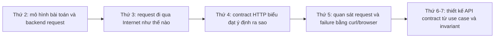

# Tuần 1 - Backend mindset, Internet, HTTP và API fundamentals

**Giai đoạn:** Core Theory + Guided Mini Labs

**Chế độ học:** Thứ 2-4 học chuyên sâu. Thứ 5-7 kiểm chứng mental model bằng mini lab độc lập. Chưa bắt đầu dự án thật.

## 1. Mục tiêu tuần

| Hạng mục | Nội dung |
|---|---|
| Goal | Nhìn backend như một hệ thống có contract, boundary, state, invariant, side effect và failure; framework chỉ là một công cụ triển khai. |
| System thinking | Lần theo được một request từ client qua DNS/TCP/TLS/HTTP tới application và dependency; chỉ ra nơi trạng thái thay đổi, lỗi có thể xảy ra và tín hiệu cần quan sát. |
| API thinking | Thiết kế API từ actor, use case và invariant trước khi chọn URL/method/status; phân biệt resource với representation và safe với idempotent/cacheable. |
| Failure thinking | Phân biệt network failure, timeout, HTTP failure, domain conflict và programmer error; không retry mù quáng. |
| Project rule | Không code hoặc scaffold trong Movie Ticket Booking. Chỉ dùng công cụ và code harness nhỏ, độc lập, phục vụ mini lab tuần 1. |

## 2. Learning arc của tuần

Mọi ngày đều dùng cùng một chuỗi suy luận:

> Actor/use case → input/output → boundary → state/invariant → side effect → failure → contract → evidence.

## 3. Kế hoạch học tập theo ngày

| Ngày | Loại buổi | Trọng tâm | Bằng chứng bắt buộc |
|---|---|---|---|
| Thứ 2 | Theory Deep Dive | System thinking, problem decomposition, request boundary, state, invariant, side effect và failure taxonomy | Một request flow, một decomposition worksheet và một failure map |
| Thứ 3 | Theory Deep Dive | Internet mental model: layers, URL/host/port/socket, DNS cache/TTL, TCP/TLS, proxy, latency budget, timeout, retry/cancellation và partial failure | Request timeline, latency budget và timeout/retry decision table |
| Thứ 4 | Theory Deep Dive | HTTP/API contract-first: resource/representation, method semantics, status, content negotiation, cookie, cache/conditional request, CORS, REST và API evolution | Method/status table, cache/CORS flow và contract review checklist |
| Thứ 5 | Guided Mini Lab | Quan sát request với `curl -v/-i`, timing, status, timeout, network-vs-HTTP failure và CORS trên hai origin local được kiểm soát | Hypothesis → command → observation → explanation cho từng thí nghiệm |
| Thứ 6-7 | Contract Design Lab | Thiết kế API cửa hàng sách từ actor/use case/invariant; schema, stable pagination, error catalog, idempotency key, optimistic concurrency, state transition và decision log | API contract hoàn chỉnh tại `labs/tuan-1/api-design/contract.md` |

## 4. Output bắt buộc

- System/request model có ít nhất 5 boundary/component và đánh dấu nơi state thay đổi.
- Problem-decomposition worksheet có precondition, postcondition, invariant, side effect, edge case và failure path.
- Internet request timeline từ parse URL tới response, gồm DNS, TCP, TLS, HTTP, proxy/application và dependency.
- Latency budget và timeout/retry decision table; nêu rõ deadline tổng và điều kiện được retry.
- HTTP method/status decision table; phân biệt safe, idempotent và cacheable bằng ví dụ.
- Conditional-cache flow và CORS preflight flow.
- HTTP lab evidence theo mẫu hypothesis → observation → explanation.
- API contract mini lab có schema, error catalog, pagination, idempotency, concurrency và design decisions.
- Interview answers theo đúng chủ đề của từng ngày.

## 5. Exit criteria đo được

Kết thúc tuần, người học phải tự làm được các việc sau mà không nhìn đáp án mẫu:

1. Vẽ và thuyết minh một request flow trong tối đa 5 phút.
2. Từ một use case ngắn, tìm được actor, input/output, ít nhất 2 invariant, 2 side effect và 4 failure path.
3. Phân biệt DNS/TCP/TLS/HTTP failure dựa trên triệu chứng và evidence, không dựa vào phỏng đoán.
4. Giải thích khác nhau giữa connect timeout, read timeout và overall deadline; chỉ ra khi retry có thể tạo duplicate side effect.
5. Chọn method và status cho ít nhất 8 tình huống, kèm lý do về semantics.
6. Giải thích vì sao CORS là chính sách của browser và mô tả được preflight.
7. Review một API contract để tìm pagination không ổn định, error mơ hồ, lost update và duplicate request.
8. Hoàn thành toàn bộ checklist trong hai artifact lab mà không lưu secret thật.

## 6. Interview drill theo ngày

| Ngày | Câu hỏi trọng tâm |
|---|---|
| Thứ 2 | Vì sao framework không phải là backend? Boundary, invariant và side effect khác nhau thế nào? |
| Thứ 3 | Một HTTPS request đi qua những bước nào? Timeout và retry có thể làm hệ thống tệ hơn ra sao? |
| Thứ 4 | Safe, idempotent và cacheable khác nhau thế nào? Chọn status code sai gây hậu quả gì? |
| Thứ 5 | Phân biệt network failure, HTTP error và CORS error bằng evidence nào? |
| Thứ 6-7 | Idempotency key và optimistic concurrency giải quyết hai failure khác nhau nào? |

## Required Reading By Day

| Ngày | Cơ bản/Trung bình | Nâng cao |
|---|---|---|
| Mon | [MDN - Overview of HTTP](https://developer.mozilla.org/en-US/docs/Web/HTTP/Guides/Overview) | [RFC 9110 - HTTP Semantics](https://www.rfc-editor.org/rfc/rfc9110) |
| Tue | [Cloudflare Learning - What is DNS?](https://www.cloudflare.com/learning/dns/what-is-dns/) | [High Performance Browser Networking - Building Blocks of TCP](https://hpbn.co/building-blocks-of-tcp/) và [Transport Layer Security (TLS)](https://hpbn.co/transport-layer-security-tls/) |
| Wed | [MDN - HTTP Messages](https://developer.mozilla.org/en-US/docs/Web/HTTP/Messages) | Đọc chọn lọc RFC 9110 về method, status và conditional requests |
| Thu | [MDN - HTTP Request Methods](https://developer.mozilla.org/en-US/docs/Web/HTTP/Methods) | [MDN - Cross-Origin Resource Sharing (CORS)](https://developer.mozilla.org/en-US/docs/Web/HTTP/CORS) |
| Fri-Sat | [MDN - HTTP Response Status Codes](https://developer.mozilla.org/en-US/docs/Web/HTTP/Status) | [RFC 9110 Section 9.2.2 - Idempotent Methods](https://www.rfc-editor.org/rfc/rfc9110#section-9.2.2) |
