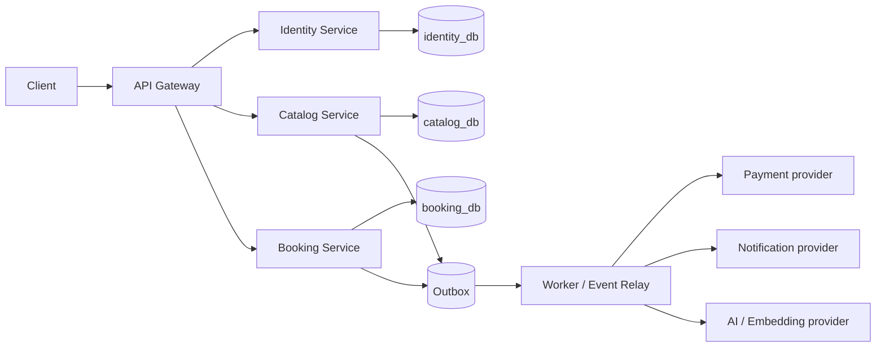

# Kiến trúc Microservice — Movie Ticket Booking

## 1. Mục tiêu và giới hạn

Project dùng microservice để học **service boundary, data ownership, distributed failure và vận hành**, không phải để tối đa số lượng deployable. MVP gồm bốn tiến trình nghiệp vụ và một lớp giao tiếp bất đồng bộ:



- Không shared database, không cross-service ORM relation và không join trực tiếp giữa các database.
- Không distributed transaction/2PC. Mỗi business invariant phải có một service owner và một transaction local.
- Worker không phải business service thứ năm: nó relay outbox, xử lý job chậm/retryable và gọi provider ngoài.
- Semantic search là capability của Catalog Service; có thể là stretch/optional nếu core booking chưa ổn định.

## 2. Service ownership

| Thành phần | Sở hữu | Không sở hữu | Giao tiếp chính |
|---|---|---|---|
| API Gateway | External API contract, routing, request/trace ID, rate limit ở biên, xác thực token ở mức edge | Business rule, database, transaction nghiệp vụ | HTTP tới service; truyền correlation/actor context đáng tin cậy |
| Identity Service | User, credential hash, refresh session/token lifecycle, role/permission claims | Movie, booking, ticket, seat state | HTTP cho auth/refresh; public key/JWKS hoặc token verification contract |
| Catalog Service | Movie, cinema, screen, seat layout, showtime metadata, public search, embedding documents | Hold, booking, payment, ticket | HTTP read/write; publish `catalog.showtime.published/cancelled` |
| Booking Service | Showtime-seat snapshot, hold, booking, payment record, ticket, check-in, idempotency and booking outbox | Canonical movie/cinema administration, user credential | HTTP command/query; consume catalog events; publish booking/payment events |
| Worker/Event Relay | Outbox relay, delayed expiry, retry/DLQ, provider adapters, notification/payment/AI jobs | Source of truth cho booking/catalog/user | Queue/event contract và provider API |

## 3. Data ownership và read model

Catalog không cập nhật trực tiếp seat state trong `booking_db`. Khi Admin publish/cancel showtime, Catalog ghi state của mình và outbox event trong **cùng local transaction**. Booking consume event idempotently để tạo/cập nhật snapshot `showtime_seats` của riêng nó.

| Dữ liệu | Owner | Bản sao/read model được phép | Đồng bộ |
|---|---|---|---|
| User/role/session | Identity | `actorId`, role/permission claim ngắn hạn ở Gateway/consumer | Token/public-key contract; không copy password/session |
| Movie/cinema/screen/showtime | Catalog | Snapshot tối thiểu cho booking/ticket receipt | Catalog event + consumer inbox/idempotency |
| Seat availability, hold, booking, payment, ticket | Booking | Catalog chỉ có thể hiển thị derived availability nếu cần | Query API hoặc event/read model, không write ngược |
| Embedding/search document | Catalog | Không cần copy sang Booking | Catalog-local job/outbox |

`showtime_seat` thuộc Booking vì invariant “một ghế của một suất chỉ được hold/sold một lần” phải được bảo vệ bằng transaction và constraint **trong một database**.

## 4. API và event contract

### External HTTP

Client chỉ gọi Gateway. Gateway giữ public paths ổn định như `/movies`, `/auth/*`, `/showtimes/:id/seats`, `/bookings`, `/tickets/*`; nó route theo service ownership và chuyển `requestId`, `traceId`, actor context đã xác minh.

Service không tin tùy tiện các header actor từ Internet. Trong dev, Gateway có thể ký/forward một internal actor context; production cần mTLS/network policy hoặc token verification độc lập theo chiến lược được ghi rõ.

### Event envelope tối thiểu

```json
{
  "eventId": "uuid",
  "eventType": "catalog.showtime.published.v1",
  "occurredAt": "2026-07-12T10:00:00Z",
  "producer": "catalog-service",
  "traceId": "...",
  "payload": {}
}
```

- Event immutable, versioned và chỉ chứa dữ liệu tối thiểu cần cho consumer.
- Consumer lưu `eventId`/outcome để chịu at-least-once delivery; không giả định exactly-once.
- Thay đổi schema theo additive-first: producer có thể thêm field optional, consumer bỏ qua field chưa biết; breaking change dùng version/event mới.

### Event MVP

| Producer | Event | Consumer | Mục đích |
|---|---|---|---|
| Catalog | `catalog.showtime.published.v1` | Booking | Tạo seat snapshot có thể đặt |
| Catalog | `catalog.showtime.cancelled.v1` | Booking | Chặn flow mới/điều phối refund theo rule |
| Booking | `booking.hold.expired.v1` | Booking worker | Release hold idempotently |
| Booking | `booking.payment.requested.v1` | Payment worker | Tạo payment link ngoài transaction booking |
| Booking | `booking.confirmed.v1` | Ticket/notification worker | Gửi receipt, tạo projection/search nếu cần |
| Catalog | `catalog.movie.changed.v1` | Catalog AI worker | Rebuild embedding asynchronous |

## 5. Consistency và failure rules

1. Một command ghi state + outbox record trong cùng transaction local.
2. Relay publish event sau commit; nếu crash sau publish trước mark-done, event có thể bị gửi lại.
3. Consumer phải idempotent qua inbox/dedup key + transaction local.
4. Không gọi payment/email/AI provider khi đang giữ database lock.
5. API timeout sau command có thể là unknown outcome: client retry cùng idempotency key hoặc query operation result.
6. Cross-service data cần consistency tức thời phải được thiết kế lại để một service sở hữu invariant hoặc dùng synchronous contract với timeout/fallback rõ; không “mở DB bên kia”.

## 6. Repository và local development

```text
apps/
  api-gateway/
  identity-service/
  catalog-service/
  booking-service/
  worker/
packages/
  contracts/        # versioned DTO/event schema, không chứa domain rule
  observability/    # request/trace/log helpers
infra/
  compose/
  postgres/
  redis/
docs/
```

Local development dùng Docker Compose với một Postgres instance có **database/schema/credential tách cho mỗi service** hoặc nhiều Postgres container; Redis/queue chỉ là hạ tầng chung, không phải nơi chứa business source of truth.

## 7. Definition of Done cho một service slice

- Boundary, owner, API/event contract và non-goal được ghi trong ADR ngắn.
- Service chỉ migration database của chính nó; không import entity/repository của service khác.
- Có request/trace ID xuyên Gateway → service → outbox/job.
- Có timeout, error mapping và health/readiness riêng.
- Có contract test hoặc consumer-driven example cho HTTP/event quan trọng.
- Có test duplicate event/idempotency, failure/retry và evidence không lộ secret.

## 8. Tiến hóa theo tuần

| Tuần | Mục tiêu microservice |
|---:|---|
| 3 | Hiểu boundary, ownership, synchronous vs asynchronous, distributed failure, outbox/inbox và observability context |
| 4 | Monorepo + Compose + Gateway + Catalog Service skeleton và public contract |
| 5 | Catalog database ownership, migrations, read APIs; publish showtime event |
| 6 | Identity Service, Gateway authentication context, service-to-service trust/authorization |
| 7 | Booking database ownership, showtime snapshot, hold/booking/ticket local transaction |
| 8 | Outbox relay, worker, payment/webhook, expiry, idempotent consumer; AI optional trong Catalog |
| 9 | Service-level telemetry, resilience, Compose/CI/deploy/runbook |
| 10 | Distributed system design, load/failure test, evidence and trade-off defense |
