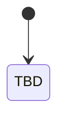
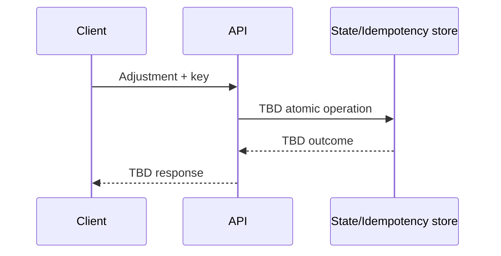

# Book Store API Contract — Bài làm của học viên

> Artifact cho `study/tuan-1/thu-6-7.md`. Đây là template thiết kế, không phải đáp án. Thay toàn bộ `TBD` bằng lập luận, ví dụ và quyết định của bạn; chưa code controller/database/framework.

## 0. Metadata và phạm vi

| Mục | Nội dung |
|---|---|
| Người thực hiện | TBD |
| Ngày/version | TBD |
| Contract base path/version | TBD |
| Assumptions đã xác nhận | TBD |
| Câu hỏi còn mở | TBD |
| Out of scope | TBD |

### Quy ước chung

| Quyết định | Lựa chọn của tôi | Lý do/trade-off |
|---|---|---|
| ID format và ownership | TBD | TBD |
| Money/currency representation | TBD | TBD |
| Date/time/timezone format | TBD | TBD |
| Content type và character encoding | TBD | TBD |
| Authentication/authorization assumption | TBD | TBD |
| Correlation/trace ID | TBD | TBD |
| Compatibility/versioning policy | TBD | TBD |

## 1. Actor, outcome và use case

| ID | Actor | Outcome mong muốn | Input chính | State đọc/ghi | Failure quan trọng | Endpoint trace |
|---|---|---|---|---|---|---|
| UC-01 | TBD | TBD | TBD | TBD | TBD | TBD |
| UC-02 | TBD | TBD | TBD | TBD | TBD | TBD |
| UC-03 | TBD | TBD | TBD | TBD | TBD | TBD |
| UC-04 | TBD | TBD | TBD | TBD | TBD | TBD |
| UC-05 | TBD | TBD | TBD | TBD | TBD | TBD |
| UC-06 | TBD | TBD | TBD | TBD | TBD | TBD |
| UC-07 | TBD | TBD | TBD | TBD | TBD | TBD |
| UC-08 | TBD | TBD | TBD | TBD | TBD | TBD |

## 2. Domain glossary và invariant catalog

### Glossary

| Term | Định nghĩa trong domain này | Không đồng nghĩa với |
|---|---|---|
| Book | TBD | TBD |
| ISBN | TBD | TBD |
| Inventory/stock | TBD | TBD |
| Inventory adjustment | TBD | TBD |
| Lifecycle/status | TBD | TBD |
| Version/validator | TBD | TBD |

### Invariants

| ID | Invariant phải luôn đúng | Owner/boundary bảo vệ | Invalid example | Failure code dự kiến |
|---|---|---|---|---|
| INV-01 | TBD | TBD | TBD | TBD |
| INV-02 | TBD | TBD | TBD | TBD |
| INV-03 | TBD | TBD | TBD | TBD |
| INV-04 | TBD | TBD | TBD | TBD |
| INV-05 | TBD | TBD | TBD | TBD |
| INV-06 | TBD | TBD | TBD | TBD |
| INV-07 | TBD | TBD | TBD | TBD |
| INV-08 | TBD | TBD | TBD | TBD |

## 3. Resource và state model

### Resource relationships


### Lifecycle state diagram



### Transition table

| Current state | Command | Actor | Preconditions/guard | Next state | Atomic state change | Side effect sau commit | Invalid behavior |
|---|---|---|---|---|---|---|---|
| TBD | TBD | TBD | TBD | TBD | TBD | TBD | TBD |

## 4. Representation và schema

Mỗi field phải phân biệt `required`, `optional` và `nullable`; ghi rõ field do client hay server sở hữu.

### 4.1 `Book` response

| Field | Type/format | Required/nullable | Owner/read-only | Constraint/meaning | Evolution note |
|---|---|---|---|---|---|
| TBD | TBD | TBD | TBD | TBD | TBD |

```json
{
  "TBD": "TBD"
}
```

### 4.2 Create request

| Field | Type/format | Required/nullable | Validation | Domain rule | Error code |
|---|---|---|---|---|---|
| TBD | TBD | TBD | TBD | TBD | TBD |

```json
{
  "TBD": "TBD"
}
```

### 4.3 Replace/Patch request

- Semantics đã chọn (replace hoặc partial update): TBD
- Omitted khác `null`: TBD
- Operation có idempotent theo contract không: TBD
- Concurrency precondition: TBD

| Field/operation | Meaning | Validation/invariant | Khi gọi lặp | Error code |
|---|---|---|---|---|
| TBD | TBD | TBD | TBD | TBD |

### 4.4 Inventory set request

```json
{
  "TBD": "TBD"
}
```

- Intended effect nếu gọi hai lần: TBD
- Atomic invariant: TBD
- Concurrency rule: TBD

### 4.5 Inventory adjustment command/result

```json
{
  "TBD": "TBD"
}
```

- Intended effect nếu gọi hai lần: TBD
- Idempotency-key requirement: TBD
- Điều kiện adjustment bị từ chối: TBD

### 4.6 Paginated collection response

```json
{
  "items": [],
  "nextCursor": "TBD"
}
```

### 4.7 Standard error response

```json
{
  "error": {
    "code": "TBD",
    "message": "TBD",
    "details": [],
    "traceId": "TBD"
  }
}
```

## 5. Endpoint inventory

| ID | Use case | Actor | Method | URI | Safe | Idempotent by semantics/design | Cacheable | Success | Key failures |
|---|---|---|---|---|---:|---:|---:|---|---|
| EP-01 | list books | TBD | TBD | TBD | TBD | TBD | TBD | TBD | TBD |
| EP-02 | book detail | TBD | TBD | TBD | TBD | TBD | TBD | TBD | TBD |
| EP-03 | create book | TBD | TBD | TBD | TBD | TBD | TBD | TBD | TBD |
| EP-04 | update/replace metadata | TBD | TBD | TBD | TBD | TBD | TBD | TBD | TBD |
| EP-05 | lifecycle transition | TBD | TBD | TBD | TBD | TBD | TBD | TBD | TBD |
| EP-06 | archive/delete | TBD | TBD | TBD | TBD | TBD | TBD | TBD | TBD |
| EP-07 | set stock | TBD | TBD | TBD | TBD | TBD | TBD | TBD | TBD |
| EP-08 | adjust stock | TBD | TBD | TBD | TBD | TBD | TBD | TBD | TBD |

## 6. Detailed endpoint contracts

Sao chép subsection này cho từng endpoint `EP-01` đến `EP-08`.

### EP-XX — TBD

- **Actor/outcome/use case:** TBD
- **Authorization assumption:** TBD
- **Method + URI:** TBD
- **Safe/idempotent/cacheable classification:** TBD
- **Path/query/header parameters:** TBD
- **Request `Content-Type` / response `Accept`:** TBD
- **Request schema/example:** TBD
- **Preconditions:** TBD
- **Invariants và atomic state transition:** TBD
- **Success status/headers/body:** TBD
- **Expected failures → error catalog:** TBD
- **Duplicate/retry behavior:** TBD
- **Concurrent/stale-write behavior:** TBD
- **Compatibility/evolution note:** TBD

```http
TBD /TBD HTTP/1.1
Host: api.example.test
Accept: application/json
```

```http
HTTP/1.1 TBD
Content-Type: application/json

{"TBD":"TBD"}
```

## 7. Pagination, filtering và sorting decision

| Concern | Decision | Alternative bị loại | Trade-off/evidence cần đo |
|---|---|---|---|
| Default/max limit | TBD | TBD | TBD |
| Filters + validation | TBD | TBD | TBD |
| Sort allowlist | TBD | TBD | TBD |
| Unique tie-breaker/total order | TBD | TBD | TBD |
| Offset vs cursor | TBD | TBD | TBD |
| Cursor opacity/validation | TBD | TBD | TBD |
| Cursor binding với filter/sort | TBD | TBD | TBD |
| `totalCount` policy | TBD | TBD | TBD |

### Boundary examples

Mô tả dataset có nhiều book cùng sort key và một insert/delete giữa hai lần đọc:

| Step | Dataset/order quan sát | Cursor/request | Items trả về | Duplicate/missing? |
|---|---|---|---|---|
| 1 | TBD | TBD | TBD | TBD |
| 2 | TBD | TBD | TBD | TBD |

## 8. Error catalog

| Stable code | HTTP status | Khi nào dùng | Safe details | Client recovery | Có retry? |
|---|---:|---|---|---|---|
| TBD | TBD | malformed JSON/media type | TBD | TBD | TBD |
| TBD | TBD | field/type/range invalid | TBD | TBD | TBD |
| TBD | TBD | book not found | TBD | TBD | TBD |
| TBD | TBD | duplicate ISBN | TBD | TBD | TBD |
| TBD | TBD | invalid lifecycle transition | TBD | TBD | TBD |
| TBD | TBD | insufficient stock | TBD | TBD | TBD |
| TBD | TBD | malformed/expired cursor | TBD | TBD | TBD |
| TBD | TBD | stale validator/version | TBD | TBD | TBD |
| TBD | TBD | idempotency key payload mismatch | TBD | TBD | TBD |
| TBD | TBD | unauthenticated/unauthorized | TBD | TBD | TBD |
| TBD | TBD | rate limited | TBD | TBD | TBD |
| TBD | TBD | unexpected/dependency failure | TBD | TBD | TBD |

## 9. Idempotency protocol cho inventory adjustment

| Quyết định | Contract của tôi | Lý do/failure được xử lý |
|---|---|---|
| Header/key format | TBD | TBD |
| Scope | TBD | TBD |
| Retention/expiry | TBD | TBD |
| Request fingerprint | TBD | TBD |
| Atomic key + effect + outcome | TBD | TBD |
| Same key + same payload | TBD | TBD |
| Same key + different payload | TBD | TBD |
| Concurrent same key | TBD | TBD |
| Unknown outcome/reconciliation | TBD | TBD |



## 10. Optimistic concurrency protocol

- Validator/version format: TBD
- GET response header/field: TBD
- Write precondition header: TBD
- Atomic compare-and-swap behavior: TBD
- Success validator mới: TBD
- Missing precondition behavior: TBD
- Stale precondition status/code: TBD
- Client recovery: TBD

### Hai-editor timeline

| Step | Editor A | Editor B | Server state/version | Expected response |
|---|---|---|---|---|
| 1 | TBD | TBD | TBD | TBD |
| 2 | TBD | TBD | TBD | TBD |
| 3 | TBD | TBD | TBD | TBD |
| 4 | TBD | TBD | TBD | TBD |

## 11. API evolution và compatibility

| Change scenario | Backward-compatible? | Client risk | Rollout/mitigation |
|---|---|---|---|
| Thêm optional response field | TBD | TBD | TBD |
| Thêm enum/state value | TBD | TBD | TBD |
| Đổi field semantics/type | TBD | TBD | TBD |
| Deprecate endpoint/field | TBD | TBD | TBD |
| Đổi cursor encoding/version | TBD | TBD | TBD |
| Thay error message nhưng giữ code | TBD | TBD | TBD |

## 12. Scenario review

| # | Scenario | Expected status/code | State trước/sau | Retry/recovery | Evidence/trace |
|---:|---|---|---|---|---|
| 1 | Hai client tạo cùng ISBN đồng thời | TBD | TBD | TBD | TBD |
| 2 | Insert xảy ra giữa page 1 và page 2 | TBD | TBD | TBD | TBD |
| 3 | Nhiều book cùng sort key tại cursor | TBD | TBD | TBD | TBD |
| 4 | Price âm hoặc media type sai | TBD | TBD | TBD | TBD |
| 5 | Adjustment `-5` khi stock còn 3 | TBD | TBD | TBD | TBD |
| 6 | Commit adjustment xong nhưng response timeout | TBD | TBD | TBD | TBD |
| 7 | Key cũ được dùng lại với payload khác | TBD | TBD | TBD | TBD |
| 8 | Editor A/B cùng đọc một version rồi update | TBD | TBD | TBD | TBD |
| 9 | Book archived vẫn bị update/adjust stock | TBD | TBD | TBD | TBD |
| 10 | Client cũ không biết enum/state mới | TBD | TBD | TBD | TBD |

## 13. Design decision log

| ID | Context/forces | Options | Choice | Trade-off/consequence | Khi nào xem lại |
|---|---|---|---|---|---|
| ADR-01 | TBD | TBD | TBD | TBD | TBD |
| ADR-02 | TBD | TBD | TBD | TBD | TBD |
| ADR-03 | TBD | TBD | TBD | TBD | TBD |
| ADR-04 | TBD | TBD | TBD | TBD | TBD |
| ADR-05 | TBD | TBD | TBD | TBD | TBD |
| ADR-06 | TBD | TBD | TBD | TBD | TBD |
| ADR-07 | TBD | TBD | TBD | TBD | TBD |
| ADR-08 | TBD | TBD | TBD | TBD | TBD |

## 14. Exit review

- [ ] Mỗi endpoint trace được về actor/use case/invariant.
- [ ] Schema phân biệt required/optional/nullable và client/server ownership.
- [ ] Method/status/header mang đúng semantics; success và expected failure có examples.
- [ ] Pagination có total order + unique tie-breaker; cursor/filter/sort policy rõ.
- [ ] Error catalog có stable code, safe details và client recovery.
- [ ] Set stock và adjustment có intended effect khác nhau, được giải thích khi gọi lặp.
- [ ] Idempotency xử lý same/different payload, concurrent key, retention và unknown outcome.
- [ ] Optimistic concurrency từ chối stale write bằng compare-and-swap atomic.
- [ ] State diagram/table có allowed và forbidden transition.
- [ ] Scenario review đủ 10 case; decision log đủ 8 quyết định có trade-off.
- [ ] Không có controller/ORM/database/framework implementation trong artifact.

## 15. Teach-back

Tóm tắt 150–250 từ: từ use case và invariant, bạn đã đi tới resource/HTTP contract thế nào; quyết định nào khó nhất, evidence nào có thể khiến bạn đổi quyết định?

TBD
