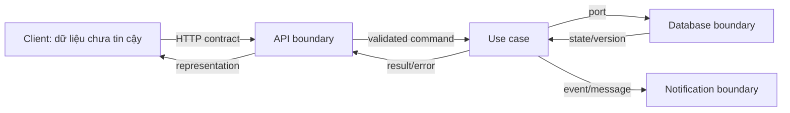
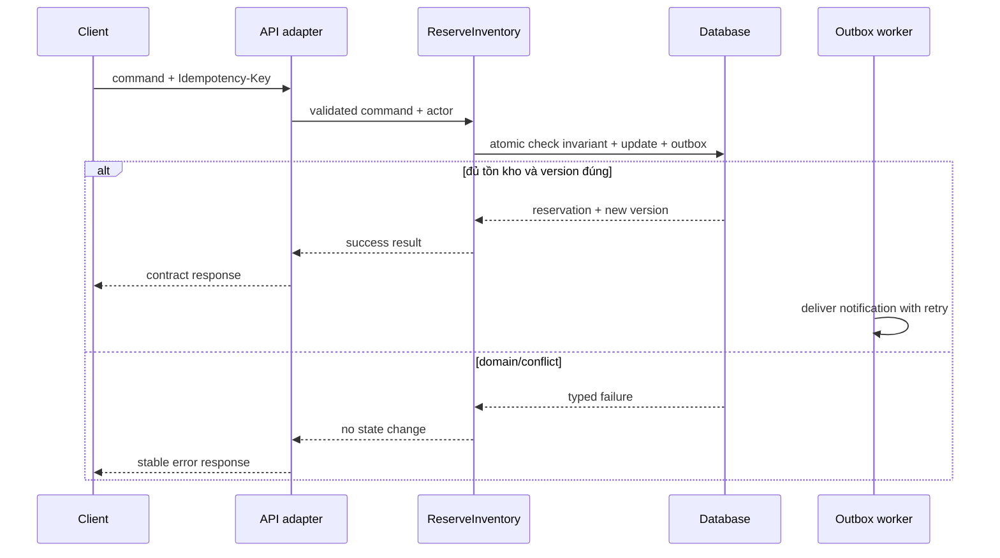

# Theory Deep Dive: Backend mindset: framework là công cụ, backend là protocol + data + failure handling

- **Tuần**: 1
- **Ngày**: Thứ 2
- **Issue**: [#1](https://github.com/vanphutin/education-backend/issues/1)
- **Giai đoạn**: Core Theory + Guided Mini Labs
- **Thời lượng gợi ý**: 4-5 giờ

## Required Reading

- **Cơ bản/Trung bình:** [MDN - Overview of HTTP](https://developer.mozilla.org/en-US/docs/Web/HTTP/Guides/Overview)
- **Nâng cao:** [RFC 9110 - HTTP Semantics](https://www.rfc-editor.org/rfc/rfc9110)
- **Đọc định hướng:** [A Philosophy of Software Design - Notes](https://web.stanford.edu/~ouster/cgi-bin/book.php)

## 1. Learning Objectives đo được

Sau buổi học, người học có thể:

1. Trong 5 phút, phân rã một use case mới thành **actor, outcome, input/output, boundary, state, invariant, side effect và failure**.
2. Vẽ request flow có ít nhất 5 component/boundary và đánh dấu chính xác nơi state thay đổi.
3. Phân biệt state, invariant, validation và side effect bằng một ví dụ và một phản ví dụ.
4. Phân loại ít nhất 8 tình huống vào failure taxonomy; nêu response/evidence cần có thay vì chỉ nói "bị lỗi".
5. Giải thích vì sao thay Express/NestJS/Spring không làm thay đổi business invariant của hệ thống.

## 2. Problem Framing: backend thật sự phải giải quyết gì?

Một framework giúp route request, parse body, gọi middleware và serialize response. Backend còn phải trả lời các câu hỏi khó hơn:

- Actor nào được làm hành động nào và kết quả business họ cần là gì?
- Dữ liệu nào đi qua trust boundary? Ai sở hữu và kiểm chứng dữ liệu đó?
- State nào được đọc, state nào được thay đổi, điều gì phải luôn đúng?
- Hành động nào tạo side effect không thể tùy tiện lặp lại?
- Khi một dependency chậm, trả kết quả mơ hồ hoặc chỉ hoàn thành một phần, hệ thống làm gì?
- Contract nào giúp client biết request thành công, bị từ chối hay có thể thử lại?
- Evidence nào giúp vận hành phân biệt lỗi client, lỗi domain, lỗi dependency và bug code?

Mental model dùng xuyên suốt ba tuần đầu:

```text
Actor/outcome
    ↓
Use case + input/output
    ↓
Boundary + contract
    ↓
State + invariant
    ↓
Side effect
    ↓
Failure + recovery + evidence
```

> Framework nằm quanh các bước triển khai. Nó không quyết định outcome, invariant hay chính sách xử lý failure thay cho đội phát triển.

## 3. Knowledge Map & Mental Models

### 3.1 System/problem decomposition

| Thành phần | Câu hỏi bắt buộc | Ví dụ: đặt giữ 2 cuốn sách |
|---|---|---|
| Actor/outcome | Ai muốn đạt kết quả gì? | Khách muốn giữ 2 cuốn để mua, không phải chỉ "gọi endpoint". |
| Input | Dữ liệu nào đi vào? Nguồn có đáng tin không? | `bookId`, `quantity`, identity, request id; tất cả input từ client đều chưa tin cậy. |
| Output | Client cần biết gì để ra quyết định tiếp? | Reservation id, số lượng, thời điểm hết hạn hoặc error có mã ổn định. |
| Boundary | Dữ liệu/quyền sở hữu/failure domain đổi ở đâu? | Internet → API; API → database; API → payment/notification. |
| State | Giá trị nào tồn tại và thay đổi theo thời gian? | `availableStock`, reservation, trạng thái đơn. |
| Invariant | Mệnh đề nào phải luôn đúng trước và sau use case? | `availableStock >= 0`; một idempotency key không tạo hai reservation. |
| Side effect | Thay đổi nào quan sát được ngoài hàm hiện tại? | Ghi DB, giữ tồn kho, publish event, gửi email. |
| Failure | Điều gì có thể không hoàn thành hoặc có kết quả mơ hồ? | Hết hàng, version conflict, DB timeout sau khi commit, notification fail. |
| Evidence | Tín hiệu nào chứng minh điều đã xảy ra? | Status/error code, reservation id, trace id, log có context, metric. |

Decomposition tốt tạo module quanh **trách nhiệm và invariant**, không quanh tên thư viện. Ví dụ `ReserveInventory` là một use case; `BooksController`, ORM repository và HTTP serializer chỉ là adapter ở các boundary.

### 3.2 Request boundary

Boundary là nơi ít nhất một điều thay đổi: mức độ tin cậy, owner, protocol, process, transaction hoặc failure domain.



Tại mỗi boundary cần xác định:

- Contract: cấu trúc, semantics, timeout/deadline và error.
- Validation: syntactic validation ở biên khác domain invariant trong core.
- Ownership: component nào được phép thay đổi state.
- Failure isolation: lỗi downstream có được lan truyền, retry hay degrade không?
- Observability: correlation/trace id, timing, outcome và safe context; không log secret.

### 3.3 State, invariant, validation và side effect

| Khái niệm | Định nghĩa thao tác được | Ví dụ đúng | Không phải là |
|---|---|---|---|
| State | Thông tin có thể khác nhau giữa hai thời điểm | tồn kho từ 5 thành 3 | biến hằng hoặc định nghĩa schema |
| Invariant | Mệnh đề phải đúng ở mọi state hợp lệ | `availableStock >= 0` | một câu "nên" hoặc một UI hint |
| Precondition | Điều phải đúng trước khi chạy operation | sách đang `ACTIVE` | postcondition sau khi ghi |
| Postcondition | Điều phải đúng nếu operation thành công | reservation tồn tại và tồn kho giảm đúng 2 | mọi side effect phụ đều đã thành công |
| Validation | Kiểm tra input có đúng shape/range cơ bản | `quantity` là integer dương | thay thế kiểm tra tồn kho đồng thời |
| Side effect | Thay đổi quan sát được ngoài phép tính cục bộ | ghi DB, publish event, gửi email | tạo object/biến cục bộ thuần túy |

State có thể là:

- **Persistent:** còn sau khi process tắt, ví dụ reservation trong database.
- **Ephemeral:** chỉ sống trong request/process, ví dụ request context hoặc cache in-memory.
- **Derived:** tính lại từ state nguồn, ví dụ `total = price * quantity`; lưu thêm derived state có nguy cơ lệch.

Invariant phải được bảo vệ ở nơi có đủ state và đúng atomicity. Kiểm tra `stock >= quantity` ở controller rồi cập nhật sau không bảo vệ được invariant khi hai request chạy đồng thời.

### 3.4 Failure taxonomy

Không gom mọi failure thành `500` và cũng không retry mọi exception.

| Nhóm failure | Ví dụ | Ai có thể sửa/ra quyết định? | Hành vi thường phù hợp | Evidence cần có |
|---|---|---|---|---|
| Invalid syntax/shape | `quantity: "hai"` | Client | Từ chối sớm, error chỉ rõ field | validation code + field |
| Authentication | Không có/không hợp lệ credential | Client/identity system | Yêu cầu xác thực | status/error code, không log token |
| Authorization | User hợp lệ nhưng thiếu quyền | Policy/admin | Từ chối, không tiết lộ dữ liệu nhạy cảm | actor id + policy result |
| Domain rule | `quantity=2` nhưng chỉ còn 1 | User/business | Cho chọn phương án khác | stable domain code + current fact an toàn |
| Conflict/concurrency | Version đã thay đổi | Client có thể đọc lại rồi thử | Reject stale write | expected/actual version |
| Dependency unavailable | DB/proxy/service không reachable | Hệ thống/operator | Fail fast/degrade; retry có giới hạn nếu an toàn | dependency, attempt, duration |
| Timeout/unknown outcome | Hết deadline sau khi gửi lệnh | Hệ thống phải reconcile | Không giả định thất bại; kiểm tra theo operation id | deadline, operation/idempotency key |
| Resource exhaustion | Pool/CPU/memory đầy | Operator/system design | Backpressure/load shedding | saturation metric |
| Programmer/config error | Null dereference, thiếu env | Developer/operator | 500, alert, không retry mù | stack/trace id, sanitized context |
| Partial failure | DB commit xong, email fail | Workflow/recovery | Lưu trạng thái, retry side effect độc lập | state transition + outbox/job id |

Ba trạng thái kết quả cần nhớ:

- **Known success:** có bằng chứng operation đã hoàn tất.
- **Known failure:** có bằng chứng operation không được áp dụng.
- **Unknown outcome:** client không nhận được kết quả nhưng operation có thể đã xảy ra. Đây là lý do cần idempotency, operation id và reconciliation.

## 4. Worked Example & Counterexample

### 4.1 Worked example: đặt giữ tồn kho

**Use case:** khách đặt giữ 2 bản của sách `B-42` trong 15 phút.

**Preconditions:** identity hợp lệ; sách `ACTIVE`; `quantity` là integer dương.

**Invariants:** tồn kho không âm; một reservation chỉ thuộc một khách; cùng idempotency key và payload chỉ tạo một kết quả.

**Atomic state transition:** `availableStock: 5 → 3`, tạo `reservation: NONE → ACTIVE`.

**Side effect sau commit:** phát `ReservationCreated`; email chỉ là side effect phụ, không được rollback reservation chỉ vì gửi mail lỗi.



Nếu response bị mất sau DB commit, client có thể gửi lại cùng idempotency key để nhận lại kết quả cũ; không tạo reservation thứ hai.

### 4.2 Counterexample: controller-driven design

```text
POST /reserve
1. controller đọc stock = 5
2. nếu stock > 0 thì stock = stock - quantity
3. gửi email
4. save()
5. catch mọi lỗi và trả 500
```

Vì sao sai:

- `stock > 0` không đủ cho `quantity=2`; invariant đúng phải là `stock >= quantity`.
- Hai request có thể cùng đọc 5 và ghi đè nhau: check và update không atomic.
- Gửi email trước commit có thể báo thành công dù save thất bại.
- Response mất sau save tạo unknown outcome; retry POST có thể trừ kho lần nữa.
- `catch → 500` làm mất khác biệt giữa invalid input, hết hàng, conflict và dependency failure.
- Business rule nằm trong controller nên bị nhân bản khi thêm queue consumer hoặc CLI.

**Invariant rút ra:** correctness không đến từ tên method/framework mà từ contract rõ, atomic state transition và failure semantics.

## 5. Design Exercise — Phần của người học

Không điền từ worked example. Hãy phân rã use case: **nhân viên điều chỉnh giá bán của một cuốn sách; giá mới có hiệu lực từ thời điểm chỉ định và không được ghi đè thay đổi mới hơn**.

| Mục | Câu trả lời của tôi |
|---|---|
| Actor và outcome | |
| Input chưa tin cậy | |
| Output thành công | |
| Các boundary | |
| Persistent/ephemeral/derived state | |
| Preconditions | |
| Ít nhất 3 invariants | |
| Atomic state transition | |
| Side effects chính/phụ | |
| Ít nhất 5 failure paths | |
| Trường hợp unknown outcome | |
| Evidence để chẩn đoán | |

### Request flow của tôi

<!-- Vẽ Mermaid/sequence diagram tại đây; đánh dấu boundary và nơi state thay đổi. -->

### Failure map của tôi

| Failure | Taxonomy | State có đổi không? | Có retry không? Vì sao? | Client/evidence nhìn thấy gì? |
|---|---|---|---|---|
| | | | | |

## 6. Common Mistakes & Debug Questions

| Sai lầm cụ thể | Hậu quả | Câu hỏi để tự phát hiện |
|---|---|---|
| Bắt đầu bằng controller/ORM schema | Thiết kế phản ánh framework hơn là business outcome | Nếu đổi transport sang queue, invariant nằm ở đâu? |
| Gọi mọi dữ liệu là "state" | Không biết nguồn sự thật và lifetime | Giá trị còn tồn tại sau restart không? Có tính lại được không? |
| Viết invariant như một bước validate ở client | Race condition vẫn phá vỡ dữ liệu | Check và write có cùng atomic boundary không? |
| Trộn side effect chính với phụ trong một try/catch | Partial failure bị che hoặc rollback sai | DB commit xong nhưng email fail thì outcome business là gì? |
| `catch (e) → 500` | Client không biết sửa request hay retry | Đây là invalid input, domain rejection, conflict hay bug? |
| Retry bất kỳ exception nào | Duplicate write và retry storm | Operation có idempotent không? Outcome cũ có thể đã thành công không? |
| Log toàn bộ request | Rò token/PII nhưng vẫn thiếu correlation | Evidence tối thiểu nào đủ chẩn đoán mà an toàn? |
| Chia module theo table hoặc thư viện | Rule bị rải ở controller/service/job | Trách nhiệm và invariant nào cần ở cùng một boundary? |

## 7. Future Project Note — Phần của người học

Sau tuần 4, kiến thức này có thể dùng ở đâu trong Movie Ticket Booking? Nếu hiểu sai, production bug nào dễ xảy ra?

<!-- Viết câu trả lời của bạn tại đây. Không code/scaffold project trong tuần 1-3. -->

## 8. Self-check & Exit Ticket

### Tự kiểm tra — Phần của người học

1. "Email xác nhận" là output, state hay side effect? Câu trả lời thay đổi thế nào nếu email là điều kiện pháp lý bắt buộc?
2. Tại sao `quantity > 0` là validation nhưng `availableStock >= quantity` là domain invariant cần concurrency control?
3. Request timeout sau 2 giây có chứng minh database chưa commit không? Cần thêm cơ chế gì?
4. Một service gọi DB và payment provider có bao nhiêu boundary? Mỗi boundary cần contract nào?
5. Khi nào `500` là đúng, và vì sao không nên trả chi tiết stack trace cho client?

### Exit criteria

- [ ] Vẽ request flow có ít nhất 5 component/boundary và đánh dấu nơi state đổi.
- [ ] Worksheet có ít nhất 3 invariant, 2 side effect và 5 failure path.
- [ ] Mỗi failure được phân nhóm và có evidence/recovery phù hợp.
- [ ] Giải thích được worked example và counterexample mà không nhìn tài liệu.
- [ ] Trả lời đúng ít nhất 4/5 câu self-check với lý do, không chỉ nêu thuật ngữ.

### Interview Drill — Phần của người học

- **Question 1:** Vì sao framework không phải là backend?
- **My answer:**

- **Question 2:** Boundary, state, invariant và side effect khác nhau thế nào? Hãy dùng một use case để minh họa.
- **My answer:**

- **Question 3:** Known failure và unknown outcome khác nhau ra sao? Thiết kế API chịu ảnh hưởng thế nào?
- **My answer:**
