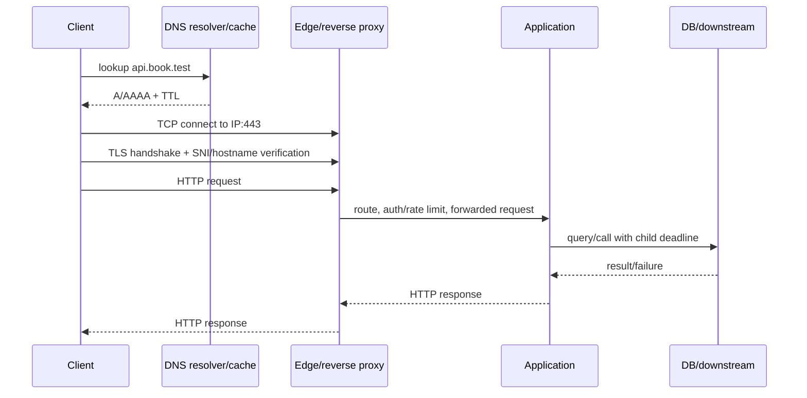

# Theory Deep Dive: Internet fundamentals: DNS, TCP/IP, TLS, latency, timeout, request lifecycle

- **Tuần**: 1
- **Ngày**: Thứ 3
- **Issue**: [#2](https://github.com/vanphutin/education-backend/issues/2)
- **Giai đoạn**: Core Theory + Guided Mini Labs
- **Thời lượng gợi ý**: 5-6 giờ

## Required Reading

- **Cơ bản/Trung bình:** [Cloudflare Learning - What is DNS?](https://www.cloudflare.com/learning/dns/what-is-dns/)
- **TCP:** [High Performance Browser Networking - Building Blocks of TCP](https://hpbn.co/building-blocks-of-tcp/)
- **TLS:** [High Performance Browser Networking - Transport Layer Security](https://hpbn.co/transport-layer-security-tls/)
- **Timeout/cancellation:** [MDN - AbortController](https://developer.mozilla.org/en-US/docs/Web/API/AbortController)
- **Chuẩn tham khảo:** [RFC 9110 - HTTP Semantics](https://www.rfc-editor.org/rfc/rfc9110)

## 1. Learning Objectives đo được

Sau buổi học, người học có thể:

1. Vẽ và thuyết minh lifecycle của một HTTPS request từ URL đến response trong tối đa 7 phút, gồm DNS, TCP, TLS, proxy, application và dependency.
2. Dựa vào triệu chứng/evidence, phân biệt DNS failure, connect failure, TLS failure, HTTP response, timeout và CORS error trong ít nhất 8/10 tình huống.
3. Lập latency budget cho một API có overall deadline; tổng ngân sách tuần tự không vượt deadline và có reserve.
4. Chọn connect/read/overall timeout phù hợp và giải thích timeout nào đang bảo vệ tài nguyên nào.
5. Dùng decision table để quyết định retry; bắt buộc xét idempotency/unknown outcome, retry budget, exponential backoff, jitter và cancellation.

## 2. Prior Knowledge & Problem Framing

Kiến thức Thứ 2 được dùng lại:

- Mỗi hop là một boundary có contract, ownership và failure domain riêng.
- Timeout không đồng nghĩa operation đã thất bại; có thể là **unknown outcome**.
- Retry là một operation mới và có thể lặp side effect.
- Evidence phải chỉ ra request dừng ở layer/hop nào.

Một URL không "chạy thẳng vào controller". Với `https://api.book.test:443/books/B-42`, client phải:

1. parse scheme/host/port/path;
2. tìm địa chỉ IP;
3. thiết lập transport connection;
4. xác thực hostname và thiết lập kênh mã hóa;
5. gửi HTTP message qua một hoặc nhiều proxy;
6. chờ application và dependency xử lý;
7. nhận/parse response hoặc kết thúc vì failure/deadline/cancellation.

## 3. Knowledge Map & Mental Models

### 3.1 Internet layers: mỗi layer hứa điều gì?

| Layer/mô hình | Đơn vị/định danh chính | Nó cung cấp | Nó không bảo đảm |
|---|---|---|---|
| Application | HTTP message, DNS record | semantics request/response; name lookup | packet delivery, business success |
| Security | TLS record, certificate/hostname | confidentiality, integrity, server identity theo certificate | server không có bug; user đã authenticated |
| Transport | TCP byte stream, `IP:port` socket | ordered reliable byte stream giữa hai endpoint khi connection còn sống | ranh giới HTTP message; request đã được xử lý |
| Network | IP packet/address | routing packet qua nhiều network | delivery, ordering, encryption |
| Link | frame/MAC trên một hop | chuyển frame ở local link | end-to-end delivery |

Các khái niệm dễ lẫn:

- **Host name** (`api.book.test`) là tên; DNS có thể ánh xạ nó tới nhiều IP.
- **IP address** định tuyến tới interface/network endpoint, không tự nói application nào.
- **Port** chọn service/process logic trên host; DNS thông thường không "trả port" cho URL.
- **Socket/connection** thường được nhận diện bởi protocol và hai cặp `IP:port`; một host có thể có nhiều connection.
- **Origin** của browser là bộ ba `scheme + host + port`; path không tạo origin mới.
- **HTTP Host/:authority** cho phép nhiều hostname dùng chung IP/proxy.

### 3.2 HTTPS request lifecycle



Connection có thể được tái sử dụng, nên không phải request nào cũng trả chi phí DNS/TCP/TLS. HTTP/2 có thể multiplex nhiều stream trên một connection. Vì vậy phải đo từng phase thay vì mặc định mọi request có cùng lifecycle vật lý.

### 3.3 DNS mental model

Luồng đơn giản hóa:

```text
browser/OS cache → recursive resolver cache → root → TLD → authoritative server
```

- Record `A/AAAA` ánh xạ tên tới IPv4/IPv6; `CNAME` tạo alias; resolver có thể đi theo chuỗi record.
- `TTL` hướng dẫn cache trong bao lâu. Thay DNS không có nghĩa mọi client thấy ngay lập tức.
- Cache có ở nhiều tầng; negative result cũng có thể được cache.
- Một hostname có thể trả nhiều IP để phân phối tải/failover; IP có thể thay đổi trong vòng đời hệ thống.
- DNS success chỉ chứng minh có kết quả phân giải, không chứng minh port mở hay application healthy.

### 3.4 TCP và TLS mental model

**TCP:** thiết lập connection, cung cấp ordered byte stream, retransmission, flow control và congestion control. TCP không giữ ranh giới `write()` của application: hai lần write có thể được đọc thành một chunk hoặc ngược lại. Connect thành công chỉ nói transport endpoint chấp nhận connection.

**TLS:** client kiểm certificate chain, hostname và thời hạn; hai phía thương lượng tham số rồi tạo session keys. TLS bảo vệ dữ liệu trên đường truyền nhưng không ngăn application trả dữ liệu sai. Lỗi TLS xảy ra **trước khi có HTTP response**, nên không có HTTP status code để đọc.

### 3.5 Proxy/gateway và địa chỉ client

| Thành phần | Đứng thay mặt | Vai trò thường gặp | Failure/nhầm lẫn phổ biến |
|---|---|---|---|
| Forward proxy | Client | outbound policy, privacy, corporate access | app thấy IP của proxy |
| Reverse proxy/load balancer | Server | TLS termination, routing, rate limit, load balancing | proxy timeout trước app timeout; trả 502/503/504 |
| API gateway | Nhiều API/backend | auth, quota, routing, transformation | business logic bị rải ở gateway và app |
| CDN/edge cache | Origin server | cache gần user, DDoS protection | stale response hoặc cache key sai |

Không tin mù quáng `X-Forwarded-For`; chỉ parse forwarded headers từ proxy tin cậy và theo đúng cấu hình chuỗi proxy.

### 3.6 Latency budget

Latency end-to-end là tổng thời gian của các bước tuần tự và critical path của các bước song song. Deadline là giới hạn business/end-user; timeout là cơ chế của từng operation để không vượt ngân sách đó.

Ví dụ endpoint có **overall deadline 1000 ms**:

| Phase tuần tự/critical path | Budget | Lý do |
|---|---:|---|
| Client ↔ edge network | 100 ms | RTT và biến động mạng |
| Proxy queue/routing | 50 ms | tránh xếp hàng không giới hạn |
| Application compute | 80 ms | validation/mapping |
| Database | 350 ms | dependency chính |
| Downstream inventory | 250 ms | child call có timeout riêng |
| Serialize + response network | 70 ms | trả kết quả |
| Reserve | 100 ms | scheduling/GC/jitter |
| **Tổng** | **1000 ms** | không vượt overall deadline |

DNS/TCP/TLS có thể thêm vào connection setup; nếu connection mới là critical path, phải trừ budget từ phase khác hoặc deadline. Không đặt mỗi dependency timeout bằng 1000 ms vì chuỗi call sẽ vượt deadline tổng.

### 3.7 Timeout, deadline và cancellation

| Cơ chế | Bảo vệ khỏi | Không chứng minh |
|---|---|---|
| DNS timeout | name lookup treo/quá chậm | hostname không tồn tại nếu chỉ thấy timeout |
| Connect timeout | không thiết lập được transport kịp thời | application không chạy |
| TLS handshake timeout | handshake/certificate exchange treo | có HTTP error |
| Write timeout | gửi request body quá chậm | server chưa nhận phần nào |
| Read/response timeout | không nhận byte/response kịp | server chưa commit |
| Idle timeout | connection không hoạt động quá lâu | toàn bộ operation thất bại |
| Overall deadline | tổng operation vượt SLO/business limit | side effect trước deadline đã được undo |

Nguyên tắc:

- Outer deadline phải được truyền xuống dưới; child operation nhận **remaining budget**, không reset đồng hồ.
- Khi client disconnect/deadline hết, propagate cancellation đến DB/downstream nếu thư viện hỗ trợ để giải phóng tài nguyên.
- Cancellation mang tính cooperative; nó không tua ngược side effect đã commit.
- Timeout quá ngắn tạo false failure và retry load; quá dài giữ connection/thread/pool quá lâu.

### 3.8 Retry, exponential backoff và jitter

Chỉ retry khi đồng thời thỏa các điều kiện:

1. failure có khả năng transient;
2. operation safe/idempotent hoặc có idempotency key/reconciliation;
3. còn deadline và retry budget;
4. attempt mới có khả năng thành công;
5. chỉ một layer chịu trách nhiệm retry hoặc các layer đã phối hợp budget.

Delay ví dụ:

```text
cap = min(maxDelay, baseDelay * 2^attempt)
sleep = random(0, cap)      # full jitter
```

Jitter làm các client không thức dậy và retry cùng lúc. Backoff không thay thế giới hạn attempt, deadline, circuit breaker hay load shedding.

| Tình huống | Retry tự động? | Điều kiện/lý do |
|---|---|---|
| DNS `NXDOMAIN` ổn định | Không | thường là cấu hình/tên sai, không transient trong request budget |
| Connect reset trước khi gửi write | Có thể | operation chưa gửi; còn budget; backoff + jitter |
| `GET` bị timeout | Có thể | safe, nhưng phải còn deadline và giới hạn attempt |
| `POST reserve` timeout sau khi gửi | Không mù quáng | unknown outcome; chỉ retry cùng idempotency key |
| `400/401/403/404` | Thường không | cùng request không tự sửa được input/quyền/resource |
| `409 version conflict` | Không lặp y nguyên | đọc state/version mới rồi quyết định lại |
| `429` | Có thể | tôn trọng `Retry-After`, quota và deadline |
| `502/503/504` | Có thể | operation idempotent, transient, budget cho phép |
| Bug `500` tái lập với cùng input | Không | retry tăng tải nhưng không sửa code |

## 4. Failure Localization: evidence trước phỏng đoán

| Quan sát | Request đã đến HTTP chưa? | Layer/hypothesis ưu tiên | Evidence tiếp theo |
|---|---|---|---|
| `Could not resolve host` | Chưa | DNS/name/config | `nslookup`/resolver result, hostname |
| `Connection refused` | Chưa | IP reachable nhưng không listener/policy reject | IP:port, listener, firewall |
| Connect timeout | Chưa | routing/drop/firewall/saturation | connect timing, route, server accept metric |
| Certificate/hostname error | Chưa | TLS trust/name/time | certificate chain, SNI, system clock |
| HTTP `404` | Có | route/resource contract | response headers/body, proxy/app logs |
| HTTP `502/503/504` | Có | proxy/dependency/overload | `Server`/trace id, upstream timing |
| Browser CORS error nhưng `curl` thấy 200 | Có thể đã thành công | browser response-access policy | browser Network tab, preflight/response CORS headers |
| Client overall timeout, server log có commit | Có thể đã commit | response mất/chậm, unknown outcome | operation/idempotency key, DB state, trace timeline |

> HTTP `5xx` vẫn là một HTTP response. Network failure thường không có HTTP status. CORS error là browser chặn script đọc response; không đồng nghĩa server không nhận request.

## 5. Worked Example & Counterexample

### 5.1 Worked example: request đặt giữ sách

Giả sử client có deadline 1200 ms và gửi `POST /reservations` với idempotency key:

- Edge nhận request và truyền remaining deadline.
- App dành 350 ms cho database transaction, 300 ms cho inventory dependency, phần còn lại cho queue/network/reserve.
- Inventory trả `503` sau 90 ms. Vì operation dùng idempotency key, còn 600 ms và failure transient, app chờ full-jitter trong cap 100 ms rồi thử **một lần**.
- Attempt 2 thành công. App ghi state và trả reservation id gắn với key.
- Nếu deadline hết sau commit, lần gọi lại cùng key trả cùng reservation, không tạo side effect mới.

Điểm quan trọng: quyết định retry dựa trên semantics + outcome + budget, không chỉ dựa trên exception class.

### 5.2 Counterexample: timeout và retry xếp tầng

```text
Client: timeout 1 s, retry 3 lần
Gateway: timeout 2 s, retry 3 lần
Service A: downstream timeout 5 s, retry 3 lần
```

Vấn đề:

- Outer timeout ngắn hơn inner timeout nên client bỏ đi khi downstream vẫn dùng tài nguyên.
- Ba tầng retry có thể khuếch đại một request thành tới 27 attempt downstream.
- Fixed delay làm retry đồng loạt; service đang quá tải nhận thêm load đúng lúc phục hồi.
- POST không có idempotency key có thể tạo duplicate side effect.
- Cancellation không truyền xuống khiến work "mồ côi" tiếp tục chạy.

## 6. Design Exercise — Phần của người học

Thiết kế lifecycle cho `POST /price-changes` có overall deadline **1500 ms**, đi qua client → reverse proxy → app → database → pricing service. Pricing service có p95 là 350 ms và đôi lúc trả 503.

### 6.1 Request timeline của tôi

<!-- Vẽ Mermaid sequence diagram; ghi rõ DNS/TCP/TLS có phát sinh hay reuse connection. -->

### 6.2 Latency budget của tôi

| Phase/critical path | Budget | Timeout/deadline | Evidence đo được | Lý do |
|---|---:|---:|---|---|
| | | | | |
| **Reserve** | | | | |
| **Tổng** | | **1500 ms** | | |

### 6.3 Retry/cancellation decision table của tôi

| Failure | Known/unknown outcome | Idempotent hoặc key? | Còn budget? | Retry? Backoff/jitter? | Cancellation truyền tới đâu? |
|---|---|---|---|---|---|
| DNS timeout | | | | | |
| TLS hostname mismatch | | | | | |
| Pricing `503` trước khi ghi | | | | | |
| DB timeout sau khi gửi commit | | | | | |
| Client disconnect | | | | | |

## 7. Common Mistakes & Debug Questions

| Sai lầm cụ thể | Hậu quả | Debug/design question |
|---|---|---|
| Nói "Internet chậm" cho mọi lỗi | Sửa sai layer | DNS/connect/TLS/TTFB/total time lần lượt là bao nhiêu? |
| Cho rằng DNS luôn chạy mỗi request | Ước lượng latency sai | Cache/connection reuse ở browser, OS, resolver còn hiệu lực không? |
| Cho rằng TCP giữ ranh giới message | Parser lỗi khi packet/chunk khác dự đoán | Code có đọc theo protocol framing hay theo một lần `read()`? |
| Cho rằng TLS = user authentication | Thiếu authn/authz ở application | Certificate đang xác thực server hay actor nào? |
| Mỗi hop đặt timeout bằng overall deadline | Tail latency vượt SLO | Remaining budget được truyền và trừ thế nào? |
| Chỉ có một timeout chung | Không biết phase nào treo | Cần connect, read và overall deadline riêng không? |
| Timeout xong coi là rollback | Duplicate side effect | Có operation id/idempotency/reconciliation không? |
| Retry ngay lập tức, không jitter | Retry storm | Ai là layer retry duy nhất? Retry budget là bao nhiêu? |
| Không propagate cancellation | Work mồ côi chiếm pool | Client disconnect có hủy DB/downstream call không? |
| Tin mọi forwarded header | Spoof IP/rate-limit bypass | Chỉ proxy nào được trust và strip/set header? |

## 8. Future Project Note — Phần của người học

Sau tuần 4, lifecycle/timeout/retry này áp dụng ở đâu trong Movie Ticket Booking? Bug nào xảy ra nếu payment/seat-hold có unknown outcome?

<!-- Viết câu trả lời tại đây. Không code/scaffold project trong tuần 1-3. -->

## 9. Self-check & Exit Ticket

### Tự kiểm tra — Phần của người học

1. DNS trả IP thành công nhưng `curl` báo connection refused. Những điều gì đã thành công và chưa thành công?
2. TLS hostname mismatch có thể trả HTTP `401` không? Vì sao?
3. Overall deadline 800 ms, DB timeout 700 ms và downstream timeout 700 ms chạy tuần tự có vấn đề gì?
4. Tại sao retry một `GET` thường an toàn hơn retry `POST`, nhưng vẫn có thể gây outage?
5. Browser báo CORS còn `curl` nhận `403`. Đây là network failure, HTTP failure hay CORS? Cần xem evidence nào trước?

### Exit criteria

- [ ] Timeline có đủ DNS, TCP, TLS, proxy, application, dependency và response.
- [ ] Latency budget có reserve, tổng critical path không vượt deadline.
- [ ] Phân biệt connect/read/overall timeout bằng ví dụ.
- [ ] Decision table xét đủ outcome, idempotency, budget, backoff, jitter và cancellation.
- [ ] Định vị đúng ít nhất 8/10 failure scenarios do mentor đưa ra.
- [ ] Trả lời đúng ít nhất 4/5 câu self-check và giải thích bằng evidence.

### Interview Drill — Phần của người học

- **Question 1:** Hãy mô tả một HTTPS request từ khi parse URL đến khi nhận response.
- **My answer:**

- **Question 2:** Timeout, deadline và cancellation khác nhau thế nào?
- **My answer:**

- **Question 3:** Khi nào retry làm hệ thống tệ hơn? Backoff, jitter và idempotency giải quyết phần nào của vấn đề?
- **My answer:**
