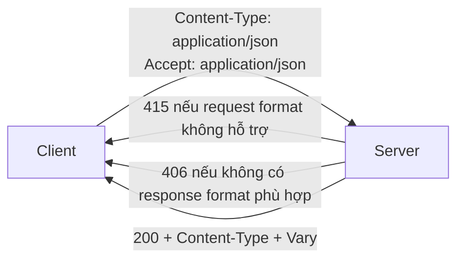
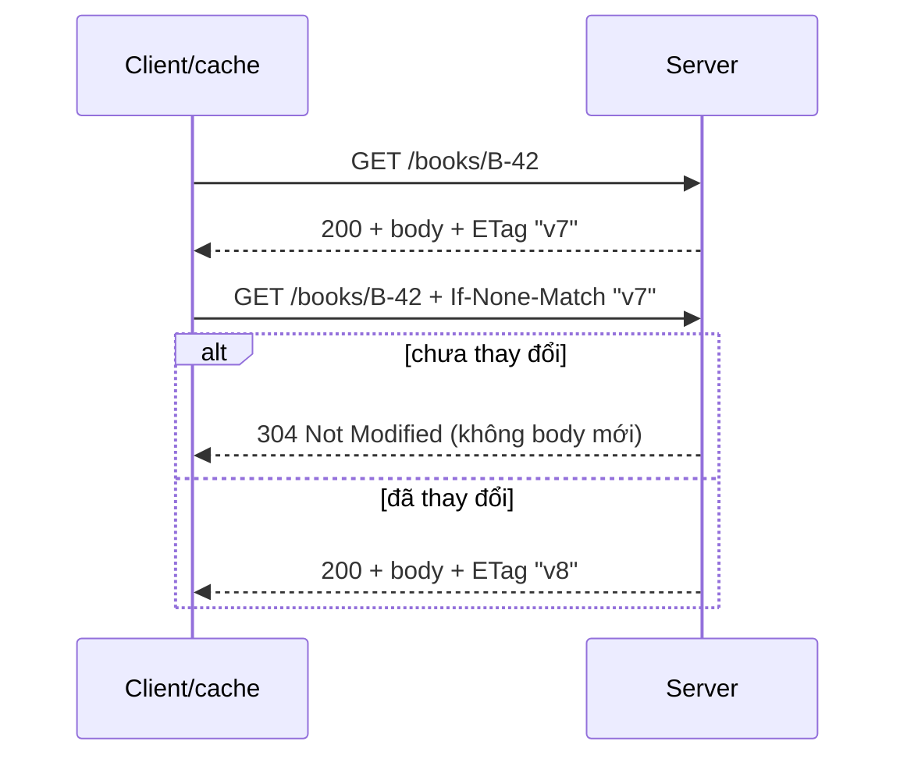
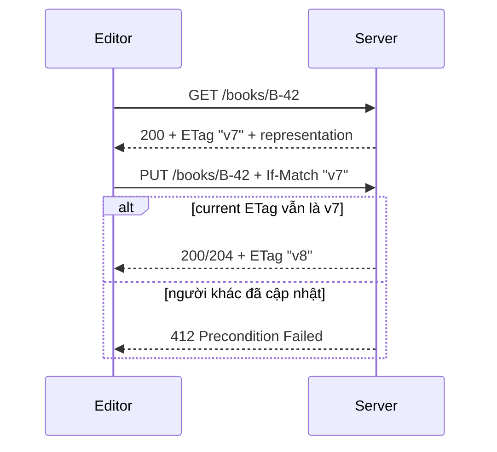

# Theory Deep Dive: HTTP/API fundamentals: method, status code, headers, body, cookie, cache, CORS, REST constraints

- **Tuần**: 1
- **Ngày**: Thứ 4
- **Issue**: [#3](https://github.com/vanphutin/education-backend/issues/3)
- **Giai đoạn**: Core Theory + Guided Mini Labs
- **Thời lượng gợi ý**: 5-6 giờ

## Required Reading

- **Cơ bản/Trung bình:** [MDN - HTTP Messages](https://developer.mozilla.org/en-US/docs/Web/HTTP/Messages)
- **Methods:** [MDN - HTTP Request Methods](https://developer.mozilla.org/en-US/docs/Web/HTTP/Methods)
- **Status:** [MDN - HTTP Response Status Codes](https://developer.mozilla.org/en-US/docs/Web/HTTP/Status)
- **Cache:** [MDN - HTTP Caching](https://developer.mozilla.org/en-US/docs/Web/HTTP/Caching)
- **CORS:** [MDN - Cross-Origin Resource Sharing](https://developer.mozilla.org/en-US/docs/Web/HTTP/CORS)
- **Nâng cao:** [RFC 9110 - HTTP Semantics](https://www.rfc-editor.org/rfc/rfc9110)

## 1. Learning Objectives đo được

Sau buổi học, người học có thể:

1. Từ 10 use case mới, xác định resource, representation, URI, method và status đúng semantics cho ít nhất 8 case, kèm lý do.
2. Phân biệt **safe**, **idempotent** và **cacheable**; tìm counterexample cho ba ngộ nhận phổ biến.
3. Thiết kế content negotiation cho JSON và giải thích vai trò khác nhau của `Content-Type`, `Accept`, `415` và `406`.
4. Vẽ conditional cache flow bằng `ETag`/`If-None-Match` và optimistic concurrency flow bằng `If-Match`/`412`.
5. Vẽ CORS simple/preflight flow và giải thích vì sao `curl` không bị same-origin policy của browser.
6. Review một API evolution proposal, tìm ít nhất 5 breaking-change risk và đề xuất migration/deprecation strategy.

## 2. Problem Framing: contract trước controller

HTTP là protocol có semantics dùng chung giữa client, proxy, cache và server. Chọn method/status/header sai không chỉ "không đẹp REST"; nó có thể làm:

- client/proxy retry một side effect không an toàn;
- cache lưu hoặc phục vụ sai response;
- browser gửi cookie ngoài dự kiến;
- monitoring coi business failure là success;
- client không phân biệt sửa request, xác thực lại, đọc state mới hay retry;
- API không thể tiến hóa mà phá consumer.

Chuỗi thiết kế:

```text
Actor/use case → resource/state transition → invariant/failure
              → HTTP method + target URI + precondition
              → request/response representation + status/header
              → cache/security/evolution policy
```

Không bắt đầu bằng tên controller hoặc CRUD table. Một API contract mô tả ý định quan sát được ở boundary, không phơi bày cấu trúc code nội bộ.

## 3. HTTP Message Mental Model

```text
Request  = method + target + protocol metadata(headers) + optional representation(body)
Response = status + protocol metadata(headers) + optional representation(body)
```

- **Method** nói semantics của operation, không chỉ là động từ tùy chọn.
- **Target URI** định danh resource/route context.
- **Header** mang metadata điều khiển protocol: media type, cache, auth, conditional request, tracing...
- **Body** là sequence bytes; `Content-Type` cho biết cách diễn giải representation.
- **Status** mô tả kết quả xử lý request ở HTTP boundary.

HTTP success không luôn đồng nghĩa business workflow đã hoàn tất (`202 Accepted`), và HTTP error vẫn là response hợp lệ chứ không phải network failure.

## 4. Resource, Representation và URI

**Resource** là khái niệm/đối tượng có identity ổn định mà API cho phép quan sát hoặc thao tác: một book, collection sách, reservation, price change. **Representation** là ảnh chụp/biểu diễn resource tại một thời điểm và media type cụ thể, ví dụ JSON hoặc CSV.

```text
Resource: book B-42
URI:      /books/B-42
JSON representation A: {"id":"B-42","title":"...","price":120000}
CSV representation B:  B-42,...,120000
```

Resource không bắt buộc tương ứng 1:1 với database table. `/books/B-42/availability` có thể là resource tổng hợp từ inventory và reservation. URI nên ổn định, dùng noun/identity; hành động domain có thể được mô hình thành resource/event, ví dụ `POST /reservations`, thay vì nhét mọi thứ vào `/doAction`.

## 5. Method Semantics: safe, idempotent, cacheable

Ba thuộc tính độc lập:

- **Safe:** client không yêu cầu thay đổi state business của resource. Logging/metrics vẫn có thể là side effect phụ.
- **Idempotent:** gửi cùng request một hay nhiều lần có **intended effect** giống một lần. Response/status có thể khác.
- **Cacheable:** response được phép lưu/reuse khi method, status và cache directives cho phép; không suy ra chỉ từ idempotency.

| Method | Semantics điển hình | Safe | Idempotent | Cacheability thực tế | Ghi chú thiết kế |
|---|---|---:|---:|---|---|
| `GET` | lấy representation | Có | Có | Thường có | không dùng để tăng counter/đặt hàng |
| `HEAD` | metadata như GET, không response body | Có | Có | Có thể | kiểm metadata/validator |
| `POST` | tạo subordinate resource hoặc xử lý command | Không | Không mặc định | Chỉ khi explicit rules/headers | có thể làm idempotent ở application bằng key |
| `PUT` | tạo/thay thế state tại target URI | Không | Có | Thường không | cùng representation đặt cùng intended state |
| `PATCH` | áp dụng patch/partial update | Không | Không được bảo đảm | Thường không | contract cụ thể có thể idempotent; `increment` thì không |
| `DELETE` | yêu cầu loại bỏ mapping/resource | Không | Có | Thường không | lần 2 có thể trả status khác nhưng intended effect vẫn "không còn" |
| `OPTIONS` | hỏi communication options | Có | Có | Thường không | browser dùng cho CORS preflight |

Counterexamples quan trọng:

- `GET /reports/run-and-charge` không safe chỉ vì dùng GET.
- `PUT {"stock":10}` idempotent; `PUT {"increment":1}` không đúng semantics và không idempotent.
- DELETE lần đầu `204`, lần sau `404` vẫn có thể idempotent vì final intended state giống nhau.
- Idempotent không có nghĩa chạy đồng thời luôn đúng; lost update vẫn cần precondition/version.

## 6. Status Code Decision Table

Chọn status theo điều client cần làm tiếp, rồi trả error body có machine-readable code ổn định.

| Status | Dùng khi | Client có thể làm gì tiếp? | Tránh nhầm với |
|---:|---|---|---|
| `200 OK` | thành công và có representation/result | dùng response | không dùng body chứa `success:false` cho mọi lỗi |
| `201 Created` | tạo resource hoàn tất | đọc `Location`/representation | `202` khi mới nhận job |
| `202 Accepted` | đã nhận nhưng xử lý chưa hoàn tất | theo dõi status resource/job | không hứa kết quả cuối thành công |
| `204 No Content` | thành công, không gửi body | tiếp tục, dùng headers nếu có | không gửi JSON body kèm 204 |
| `304 Not Modified` | conditional GET/HEAD: representation chưa đổi | dùng cached representation | không phải redirect; không có response body mới |
| `400 Bad Request` | request syntax/shape/protocol invalid | sửa request | domain conflict có state hiện tại |
| `401 Unauthorized` | thiếu/không hợp lệ authentication credentials | authenticate/refresh | `403` đã nhận diện nhưng không được phép |
| `403 Forbidden` | hiểu request nhưng policy từ chối | xin quyền/không thử y nguyên | `401`; đôi khi dùng 404 để tránh lộ resource |
| `404 Not Found` | target không tồn tại/không muốn tiết lộ | sửa id hoặc dừng | endpoint hợp lệ nhưng state conflict |
| `409 Conflict` | request xung đột current resource/domain state | đọc state/giải quyết conflict | syntax validation |
| `412 Precondition Failed` | `If-Match`/precondition HTTP không còn đúng | lấy representation/ETag mới | generic domain conflict |
| `415 Unsupported Media Type` | server không hỗ trợ request `Content-Type` | đổi định dạng request | `406` response representation |
| `422 Unprocessable Content` | syntax/media type hợp lệ nhưng instruction/content invalid | sửa field/rule được báo | cân nhắc quy ước nhất quán với 400 |
| `429 Too Many Requests` | rate limit/quota | đợi theo `Retry-After` nếu có | server dependency outage |
| `500 Internal Server Error` | bug/unexpected failure phía server | không sửa bằng cùng request; báo trace id | domain rejection dự kiến |
| `502 Bad Gateway` | gateway nhận response upstream không hợp lệ/failure | có thể retry nếu an toàn | app business error |
| `503 Service Unavailable` | tạm không phục vụ/overload/maintenance | backoff, có thể `Retry-After` | permanent validation error |
| `504 Gateway Timeout` | gateway không nhận upstream response kịp | unknown outcome; retry chỉ khi an toàn | client-side timeout không có response |

Ví dụ error contract:

```json
{
  "error": {
    "code": "BOOK_VERSION_CONFLICT",
    "message": "Book was changed by another request.",
    "details": [{ "field": "version", "reason": "stale" }],
    "traceId": "01J..."
  }
}
```

`message` có thể đổi/localize; client branch theo `code`, không parse câu chữ. Không trả stack trace, SQL, secret hoặc thông tin nhạy cảm.

## 7. Content Negotiation

- Request `Content-Type: application/json` nói **body đang gửi là gì**. Body JSON nhưng header form-encoded là contract sai.
- Request `Accept: application/json` nói client **muốn nhận representation nào**.
- Server không đọc được request media type → `415 Unsupported Media Type`.
- Server không tạo được media type client chấp nhận → `406 Not Acceptable` nếu áp dụng negotiation chặt.
- Response phải có `Content-Type` đúng; charset cần rõ khi phù hợp.
- Nếu representation thay đổi theo `Accept` hoặc `Accept-Language`, cache thường cần `Vary` tương ứng.



## 8. Cookie, Session và Browser Security

`Set-Cookie` là response header yêu cầu user agent lưu cookie theo policy. Browser tự đính kèm cookie phù hợp vào request sau, nên cookie-based authentication phải xét CSRF.

| Attribute | Ý nghĩa chính | Lưu ý |
|---|---|---|
| `Secure` | chỉ gửi qua HTTPS | nên dùng cho auth/session cookie |
| `HttpOnly` | JavaScript không đọc được | giảm rủi ro lấy token qua XSS, không ngăn XSS gửi request |
| `SameSite` | hạn chế gửi cookie trong cross-site context | `None` cần `Secure`; không thay thế toàn bộ CSRF defense |
| `Domain` | phạm vi host/domain | tránh mở rộng hơn cần thiết; host-only thường an toàn hơn |
| `Path` | phạm vi path gửi cookie | không phải security boundary mạnh |
| `Max-Age`/`Expires` | lifetime | session phía server vẫn cần revoke/expire policy |

CORS, cookie và authentication là ba cơ chế khác nhau:

- CORS quyết định script ở origin nào được browser cho đọc response/certain requests.
- Cookie quyết định credential có được tự động gửi theo scope/policy.
- Authentication xác định actor; authorization xác định actor được làm gì.

## 9. Cache-Control và Validators

Directive thường gặp:

- `no-store`: không lưu response.
- `no-cache`: có thể lưu nhưng phải revalidate trước khi reuse; không có nghĩa "không cache".
- `private`: chỉ private cache; `public`: shared cache có thể lưu nếu các điều kiện khác cho phép.
- `max-age=N`: freshness lifetime tính bằng giây.
- `Vary`: representation/cache key phụ thuộc request header nào, ví dụ `Accept-Encoding`, `Origin`.

### 9.1 Conditional GET: giảm bandwidth



`Last-Modified`/`If-Modified-Since` cũng là validator theo thời gian nhưng có độ chính xác/semantics khác. `ETag` là opaque validator; client không nên suy diễn cấu trúc bên trong.

### 9.2 Optimistic concurrency: ngăn lost update



Conditional cache và concurrency cùng dùng validator nhưng mục đích khác: `If-None-Match` thường hỏi "có mới hơn không?", `If-Match` yêu cầu "chỉ ghi nếu tôi đang sửa đúng version".

## 10. CORS Mental Model

Origin = `scheme + host + port`. `https://app.test` và `https://api.test` là khác origin; `https://app.test/a` và `/b` cùng origin.

CORS là chính sách do browser thực thi cho script. Nó không phải firewall, authentication hay authorization. Request có thể đến server và tạo side effect dù script không được phép đọc response, tùy loại request/flow.

### 10.1 Preflight flow

```mermaid
sequenceDiagram
    participant J as JavaScript at http://localhost:3000
    participant B as Browser
    participant A as API at http://localhost:4000
    J->>B: fetch with non-simple method/header
    B->>A: OPTIONS + Origin + Access-Control-Request-Method/Headers
    A-->>B: allowed origin/method/header policy
    alt policy cho phép
        B->>A: actual request + Origin
        A-->>B: response + Access-Control-Allow-Origin
        B-->>J: expose permitted response
    else policy không cho phép
        B-->>J: CORS error; actual request không được gửi
    end
```

Lưu ý:

- "Simple" request có thể được gửi không preflight nhưng response vẫn cần CORS headers để JavaScript đọc.
- Với credentials, không dùng `Access-Control-Allow-Origin: *`; server phải trả exact allowed origin và policy credentials phù hợp.
- Chỉ echo `Origin` sau allowlist check; nếu response khác theo origin, xét `Vary: Origin`.
- Preflight success không thay thế auth của actual request.
- `curl`/server-to-server không bị browser same-origin policy, nhưng vẫn có thể tự gửi/quan sát headers.

## 11. REST Constraints và API Evolution

REST constraints gồm client-server, stateless, cacheable, uniform interface, layered system và code-on-demand (tùy chọn). Với API thực hành tuần này, tập trung vào:

- resource identity và representation;
- self-descriptive HTTP messages;
- method/status/cache semantics chuẩn;
- stateless request: server không phụ thuộc context hội thoại ẩn giữa các request;
- layered system: client không cần biết trực tiếp app hay proxy đang trả response.

"JSON qua HTTP" chưa tự động là REST. Tuy nhiên cũng không nên biến REST thành cuộc thi đặt URL; correctness, invariant và explicit contract vẫn quan trọng hơn hình thức.

### API evolution checklist

| Thay đổi | Rủi ro | Hướng an toàn hơn |
|---|---|---|
| đổi tên/xóa field | client cũ parse/hành vi lỗi | thêm field mới, deprecate, đo usage rồi mới sunset |
| đổi type `number → string` | breaking schema | field/version mới hoặc migration rõ |
| thêm required request field | client cũ không gửi | optional + default/negotiation/version |
| thêm enum value | exhaustive client có thể vỡ | document unknown handling; contract test |
| đổi meaning/status/error code | silent behavior break | giữ semantics; version khi không thể tương thích |
| đổi pagination ordering | duplicate/missing item | stable total order + cursor contract |
| bỏ endpoint ngay | downtime consumer | deprecation notice, migration window, telemetry, sunset |

Version có thể nằm ở URI, media type/header hoặc contract deployment strategy; mỗi cách có trade-off. Quan trọng là compatibility policy, migration path và observability consumer, không chỉ chọn `/v1`.

## 12. Worked Example & Counterexample

### 12.1 Worked example: đọc và cập nhật book

1. `GET /books/B-42` với `Accept: application/json`.
2. Server trả `200`, `Content-Type: application/json`, `Cache-Control: private, no-cache`, `ETag: "book-v7"` và representation.
3. Client revalidate bằng `If-None-Match: "book-v7"`; nếu chưa đổi, nhận `304`.
4. Editor thay toàn bộ representation qua `PUT /books/B-42` kèm `If-Match: "book-v7"`.
5. Nếu state hiện tại đã là `v8`, server trả `412` với error code `BOOK_VERSION_STALE`; client phải fetch/merge, không lặp write y nguyên.

Contract này dùng validator cho cả bandwidth và lost-update protection nhưng tách rõ hai precondition.

### 12.2 Counterexample: RPC tùy tiện trên HTTP

```text
GET /api/do?command=deleteBook&id=B-42
POST /api/getBooks
Mọi response đều 200 { "ok": false, "error": "something wrong" }
Access-Control-Allow-Origin: * + credentials
Không Content-Type, Cache-Control, ETag hay stable error code
```

Hậu quả: crawler/prefetch có thể kích hoạt delete; cache/proxy không hiểu semantics; monitoring coi lỗi là success; client parse text; CORS credentials policy invalid; concurrent editor ghi đè; API không có đường tiến hóa an toàn.

## 13. Design Exercise — Phần của người học

Thiết kế contract cho ba use case: **xem book**, **thay toàn bộ metadata book**, **tăng tồn kho thêm 1**. Với mỗi use case, phải chỉ ra vì sao method có/không safe, idempotent và cacheable.

| Use case | Resource/URI | Method | Safe? | Idempotent? | Cacheable? | Success status/headers | Failure status/error code |
|---|---|---|---|---|---|---|---|
| Xem book | | | | | | | |
| Thay metadata | | | | | | | |
| Tăng tồn kho | | | | | | | |

### Representation/content negotiation của tôi

<!-- Viết request/response JSON mẫu, Content-Type, Accept, 406/415 behavior tại đây. -->

### Cache và concurrency flow của tôi

<!-- Vẽ hai flow riêng: If-None-Match và If-Match. -->

### CORS policy của tôi

| Origin | Method/header/credentials | Preflight? | Response headers | Cho phép? Vì sao? |
|---|---|---|---|---|
| | | | | |

### Evolution decision của tôi

<!-- Đề xuất cách thêm `discountPrice` và deprecate `legacyPrice` mà không phá client cũ. -->

## 14. Common Mistakes & Debug Questions

| Sai lầm cụ thể | Hậu quả | Câu hỏi kiểm tra |
|---|---|---|
| URI là động từ, method dùng tùy ý | mất semantics của intermediary | Resource/state transition thực sự là gì? |
| `POST` luôn tạo, `PUT` luôn update một phần | contract sai | Target URI do ai chọn và request biểu đạt state gì? |
| Idempotent = response giống hệt | đánh giá DELETE/conditional request sai | Intended final effect có giống nhau không? |
| `204` kèm JSON body | client/proxy xử lý không nhất quán | Có cần body thì tại sao không dùng 200? |
| Mọi lỗi trả 200 | retry/monitoring/cache sai | Client cần hành động tiếp theo nào? |
| `Content-Type` và `Accept` dùng lẫn | parse/negotiation lỗi | Header mô tả request body hay desired response? |
| `no-cache` được hiểu là không lưu | cache policy sai | Muốn không lưu hay muốn revalidate? |
| ETag chỉ để cache | lost update | Write có yêu cầu `If-Match` không? |
| CORS được coi là auth | API vẫn mở cho non-browser client | Actual request có authn/authz độc lập không? |
| `*` với credentials | browser từ chối | Exact allowed origin và `Vary` đã đúng chưa? |
| Chỉ thêm `/v2` là xong evolution | consumer vẫn bị bỏ rơi | Deprecation, migration, usage telemetry ở đâu? |

## 15. Future Project Note — Phần của người học

Sau tuần 4, method/status/cache/CORS/concurrency áp dụng ở đâu trong Movie Ticket Booking? Endpoint nào tuyệt đối không được thiết kế như safe GET?

<!-- Viết câu trả lời tại đây. Không code/scaffold project trong tuần 1-3. -->

## 16. Self-check & Exit Ticket

### Tự kiểm tra — Phần của người học

1. `DELETE` lần hai trả `404` có làm method mất tính idempotent không? Giải thích theo intended effect.
2. `PATCH {"increment":1}` và `PATCH {"price":120000}` khác nhau thế nào về idempotency?
3. Khi nào dùng `409`, khi nào dùng `412`? Cho một ví dụ có ETag.
4. Browser đã preflight thành công nhưng actual request trả `401`. CORS có hỏng không?
5. `Cache-Control: no-cache` khác `no-store` thế nào và `304` lấy body ở đâu?

### Exit criteria

- [ ] Method/status table đạt ít nhất 8/10 scenario mentor đưa ra.
- [ ] Giải thích đúng safe/idempotent/cacheable bằng ví dụ và counterexample.
- [ ] Viết request/response có `Content-Type`, `Accept`, validator và error code đúng vai trò.
- [ ] Vẽ đúng conditional GET, optimistic concurrency và CORS preflight flow.
- [ ] Review evolution proposal và tìm ít nhất 5 compatibility risk.
- [ ] Trả lời đúng ít nhất 4/5 câu self-check với lý do.

### Interview Drill — Phần của người học

- **Question 1:** Safe, idempotent và cacheable khác nhau thế nào?
- **My answer:**

- **Question 2:** Status code sai có thể gây hậu quả gì cho client, cache, retry và monitoring?
- **My answer:**

- **Question 3:** CORS là gì, preflight diễn ra khi nào và vì sao `curl` không gặp CORS error?
- **My answer:**
