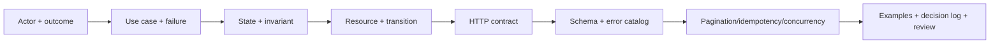
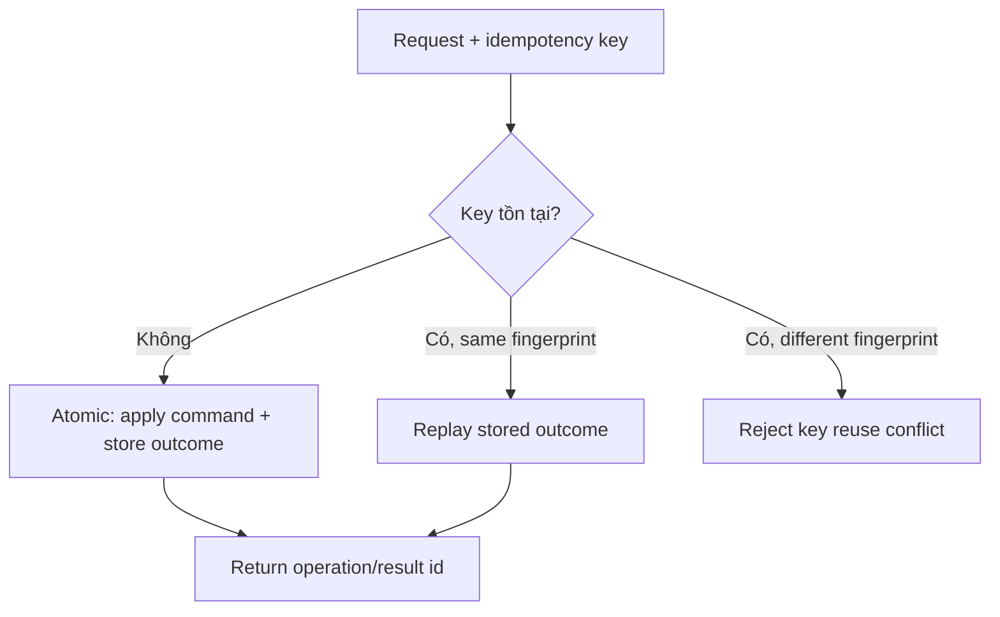

# Mini Lab Ticket: API design lab: thiết kế API contract nhỏ, idempotency, pagination, filtering và error response

- **Tuần**: 1
- **Ngày**: Thứ 6-7
- **Issue**: [#5](https://github.com/vanphutin/education-backend/issues/5)
- **Giai đoạn**: Core Theory + Guided Mini Labs
- **Thời lượng gợi ý**: 7-9 giờ trong 2 ngày
- **Artifact phải hoàn thành:** [`labs/tuan-1/api-design/contract.md`](../../labs/tuan-1/api-design/contract.md) và executable contract tests TypeScript trong `labs/tuan-1/api-design/src/`.

## Required Reading

- [MDN - HTTP Request Methods](https://developer.mozilla.org/en-US/docs/Web/HTTP/Methods)
- [MDN - HTTP Response Status Codes](https://developer.mozilla.org/en-US/docs/Web/HTTP/Status)
- [RFC 9110 Section 9.2.2 - Idempotent Methods](https://www.rfc-editor.org/rfc/rfc9110#section-9.2.2)
- [RFC 9110 - Conditional Requests](https://www.rfc-editor.org/rfc/rfc9110#name-conditional-requests)
- Ôn lại [Thứ 2 - system thinking](thu-2.md), [Thứ 3 - failure thinking](thu-3.md), [Thứ 4 - HTTP semantics](thu-4.md).

## 1. Learning Objectives đo được

Kết thúc lab, người học có thể:

1. Từ actor/outcome, viết ít nhất 8 use case và trace mỗi endpoint về đúng use case/invariant.
2. Thiết kế resource/representation/schema rõ required, optional, nullable, server-managed và validation rule.
3. Thiết kế collection API có filter và **stable pagination**, giải thích offset so với cursor và cách tránh duplicate/missing item.
4. Thiết kế error catalog có stable machine code, HTTP status, safe details và recovery action cho ít nhất 10 failure.
5. Chứng minh semantics của set stock và increment stock; dùng idempotency key để xử lý duplicate command/unknown outcome.
6. Dùng optimistic concurrency (`ETag`/`If-Match` hoặc version tương đương) để ngăn lost update, bao gồm stale-write example.
7. Mô hình state transition của book và từ chối transition không hợp lệ.
8. Ghi ít nhất 8 design decisions có context, choice, alternatives, trade-off và consequence.

### TypeScript verification loop

```powershell
cd labs/tuan-1/api-design
npm install
npm run typecheck
npm test
```

Mỗi test phải trace ngược về một invariant trong `contract.md`. Bổ sung ít nhất bốn test do học viên tự viết: negative stock, forbidden transition, invalid cursor và duplicate retry sau unknown outcome.

## 2. Lab Scenario & Scope

Thiết kế contract cho **Book Store API**. Đây là bài thiết kế, chưa implement controller/database/framework.

### Actors tối thiểu

- **Customer/catalog consumer:** duyệt, lọc, xem sách.
- **Inventory staff:** tạo/cập nhật metadata, điều chỉnh tồn kho.
- **Catalog admin:** thay đổi lifecycle/status của sách.
- **API client/integration:** có thể timeout và gửi lại request; cần contract có idempotency/concurrency.

### Use cases bắt buộc

1. Liệt kê sách với pagination, filter theo category/khoảng giá/status và sort được quy định.
2. Xem chi tiết một book.
3. Tạo book với ISBN duy nhất.
4. Thay toàn bộ hoặc cập nhật một phần metadata; nêu rõ semantics đã chọn.
5. Chuyển lifecycle của book theo state machine.
6. Xóa/archive book; định nghĩa effect khi gọi lặp lại.
7. **Set** tồn kho về một giá trị tuyệt đối.
8. **Increment/decrement** tồn kho bằng adjustment command có thể bị gửi lặp.

### Out of scope

- Không code NestJS/Express, database migration hoặc authentication implementation. Chỉ viết pure TypeScript executable specification để kiểm chứng state, idempotency, concurrency precondition và cursor contract.
- Không thiết kế checkout/payment đầy đủ.
- Không dùng Swagger generator thay cho suy luận; có thể chuyển contract sang OpenAPI sau khi Markdown đã được review.

## 3. Contract-first Workflow

Thực hiện đúng thứ tự; nếu endpoint không trace được về use case/invariant thì chưa thêm endpoint.



Mỗi endpoint phải trả lời:

- Ai gọi, để đạt outcome gì?
- Input nào chưa tin cậy? Validation nào chỉ là shape và rule nào là invariant?
- State/precondition nào được đọc, state nào thay đổi atomically?
- Operation safe/idempotent/cacheable không? Duplicate/timeout xử lý thế nào?
- Success và mỗi expected failure được biểu diễn bằng status/header/body nào?
- Concurrent request có gây lost update, oversell hoặc duplicate side effect không?
- API có thể tiến hóa mà không phá client cũ như thế nào?

## 4. Domain Model & Invariants

Không chép nguyên bảng dưới đây thành schema; đây là checklist phân tích. Người học phải tự quyết định field và ghi lý do trong artifact.

### Invariant categories phải xét

| Category | Câu hỏi gợi ý |
|---|---|
| Identity | `bookId` do ai tạo? ISBN có unique không? Case/format canonical hóa thế nào? |
| Money | price có âm được không? currency nào? Dùng integer minor unit hay decimal? |
| Inventory | stock có âm không? set và adjustment có cùng concurrency rule không? |
| Lifecycle | state nào tồn tại? transition nào hợp lệ? archived book có sửa/điều chỉnh kho được không? |
| Version | write nào làm tăng version/đổi ETag? Client cũ bị phát hiện ra sao? |
| Time | timestamp do server hay client tạo? timezone/format nào? |
| Uniqueness | race giữa hai create cùng ISBN được xử lý ở đâu và trả lỗi gì? |
| Deletion | hard delete, soft delete hay archive? GET/list sau đó thấy gì? |

Phân biệt:

- `price` phải là number/integer đúng format là validation.
- `price >= 0`, currency được hỗ trợ là domain rules.
- Hai request cùng sửa book không được silent overwrite là concurrency invariant.
- Idempotency key cùng payload không tạo hai adjustment là processing invariant.

## 5. Representation & Schema Requirements

Artifact phải có JSON/schema table cho:

- `Book` response representation.
- Create request.
- Replace hoặc patch request (nêu rõ semantics).
- Inventory set request.
- Inventory adjustment command/result.
- Paginated collection response.
- Standard error response.

Với mỗi field, ghi:

| Thuộc tính cần mô tả | Câu hỏi |
|---|---|
| Type/format | integer, decimal string, ISO 8601, enum...? |
| Required/optional/nullable | omitted khác `null` thế nào? |
| Ownership | client gửi hay server-managed/read-only? |
| Constraint | min/max/length/pattern/cross-field invariant? |
| Evolution | thêm enum/field có phá client không? unknown value xử lý thế nào? |

Không dùng một DTO cho mọi operation. Create input không nên cho client set `createdAt`, `version` hoặc server-owned id nếu contract không chủ ý cho phép.

## 6. Endpoint Contract Requirements

Mỗi endpoint trong artifact phải có:

- actor/use case và authorization assumption;
- method + URI;
- safe/idempotent/cacheable classification;
- path/query/header parameters;
- request `Content-Type`/`Accept` và JSON example nếu có;
- precondition/invariant/atomic state transition;
- success status, headers (`Location`, `ETag`, pagination link/cursor khi phù hợp) và response example;
- error mapping bằng stable error code;
- retry/duplicate/concurrency behavior.

### Method semantics phải giải thích

- Tại sao list/detail dùng GET và không tạo business side effect.
- Tạo resource bằng POST hay PUT; ai chọn URI/id và hệ quả idempotency.
- Replace bằng PUT hay partial update bằng PATCH; patch document có idempotent không.
- Set stock về 10 có intended effect khác increment `+1` như thế nào.
- DELETE/archive gọi lặp có final effect gì, dù status lần sau có thể khác.

## 7. Stable Pagination & Filtering

Thiết kế tối thiểu:

- `limit` có default và max.
- filter theo `category`, `minPrice`, `maxPrice`, `status` với validation rõ.
- sort có allowlist, direction và **tie-breaker duy nhất**.
- response có `items` và thông tin lấy trang tiếp theo.
- cursor opaque với client; server validate malformed/expired/incompatible cursor.

### Offset vs cursor decision

| Tiêu chí | Offset/page | Cursor/keyset |
|---|---|---|
| Nhảy tới trang N | Dễ | Không tự nhiên |
| Dataset thay đổi giữa hai lần đọc | Có thể duplicate/missing | Ổn định hơn nếu sort/cursor đúng |
| Deep page | Có thể chậm | Thường hiệu quả hơn với index phù hợp |
| Contract đơn giản | Dễ hiểu | Cần opaque cursor và version policy |

Cursor không tự động ổn định. Phải có total order, ví dụ sort key + unique tie-breaker; định nghĩa filter/sort có được encode/bind vào cursor không. Không hứa `totalCount` nếu hệ thống không thể đảm bảo chi phí/consistency mong muốn.

## 8. Error Catalog

Error response tối thiểu:

```json
{
  "error": {
    "code": "STABLE_MACHINE_CODE",
    "message": "Human-readable safe message",
    "details": [],
    "traceId": "correlation-id"
  }
}
```

Artifact phải map ít nhất các failure sau:

1. malformed JSON/media type không hỗ trợ;
2. field sai type/range, bao gồm price âm;
3. book không tồn tại;
4. ISBN trùng;
5. lifecycle transition không hợp lệ;
6. stock adjustment làm tồn kho âm;
7. malformed/expired cursor;
8. stale ETag/version;
9. idempotency key trùng nhưng payload khác;
10. authentication/authorization failure;
11. rate limit;
12. unexpected server/dependency failure.

`code` ổn định cho client; `message` không dùng để branch logic. `details` phải an toàn, không lộ SQL/stack/secret. `traceId` để correlation, không thay error code.

## 9. Idempotency Key Protocol

Method idempotency và application idempotency là hai tầng khác nhau. Với inventory adjustment `+1`, cùng command chạy hai lần sẽ `10 → 11 → 12`; vì thế cần protocol chống duplicate nếu client có thể retry sau timeout.

Contract phải quyết định:

- header/tên key và format/độ dài;
- scope của key: actor + endpoint/operation nào;
- retention/expiry;
- fingerprint/hash của normalized request payload;
- lưu key, outcome và state change atomically thế nào;
- request đồng thời cùng key chờ/replay hay conflict;
- cùng key + cùng payload trả lại status/body/headers nào;
- cùng key + khác payload trả error code/status nào;
- unknown outcome được query/reconcile ra sao.



Chỉ thêm header tên đẹp mà không persist outcome atomically thì chưa giải quyết duplicate.

## 10. Optimistic Concurrency

Idempotency key ngăn **cùng operation bị xử lý lặp**; optimistic concurrency ngăn **một write hợp lệ nhưng dựa trên state cũ ghi đè write mới hơn**.

Contract phải có:

1. GET trả `ETag`/version.
2. Write yêu cầu `If-Match` hoặc precondition tương đương.
3. Server so sánh atomically với current version.
4. Thành công trả validator mới.
5. Stale write trả `412 Precondition Failed` (nếu dùng HTTP precondition) với stable error.
6. Client fetch state mới rồi merge/ra quyết định; không tự động lặp y nguyên.

Phải minh họa timeline hai editor A/B cùng đọc `v7`, A ghi thành `v8`, B bị từ chối khi gửi `If-Match: v7`.

## 11. State Model

Chọn state lifecycle hợp lý cho book, ví dụ cần phân biệt chưa xuất bản, đang bán và không còn phục vụ. Người học tự chọn tên/rule, nhưng artifact phải có:

- state diagram;
- allowed/forbidden transitions;
- actor được phép;
- precondition/invariant;
- state/side effect sau thành công;
- status/error khi transition invalid;
- behavior của GET/list/update/inventory ở mỗi state.

### Phần của người học

<!-- Vẽ Mermaid stateDiagram-v2 tại contract.md; không copy một state machine mà chưa giải thích business rule. -->

## 12. Worked Example & Counterexample

### 12.1 Worked example ngoài scope: reservation command

`POST /reservations` tạo một reservation từ command không mặc định idempotent. Client gửi idempotency key; server atomically giữ tồn kho + lưu outcome. Nếu response mất, cùng key/payload trả lại reservation cũ. Editor cập nhật metadata reservation bằng `If-Match`; stale version bị `412`. Hai cơ chế giải quyết hai failure khác nhau.

### 12.2 Counterexample contract

```text
POST /getBooks?page=2
POST /updateBook { "id": 42, "stockDelta": 1, "version": 7 }
200 { "success": false, "message": "Something went wrong" }
Pagination mặc định theo updatedAt, không tie-breaker
Client retry POST với key mới mỗi lần
Server đọc version rồi save mà không compare-and-swap atomically
```

Vấn đề: method/status không mang semantics; error không actionable; pagination đổi thứ tự gây duplicate/missing; key mới không deduplicate; version field không ngăn race nếu check/write tách rời.

## 13. Two-day Execution Plan

### Thứ 6 — Domain và core contract

1. Điền actor/use-case matrix, assumptions và out-of-scope.
2. Viết glossary/domain model/invariant catalog.
3. Vẽ state diagram và transition table.
4. Viết schemas và endpoint summary.
5. Hoàn thiện list/detail/create/update/lifecycle/delete contract.
6. Self-review method/status/resource semantics.

### Thứ 7 — Failure, consistency và evolution

1. Hoàn thiện pagination/filter/sort và example nhiều item trùng sort key.
2. Hoàn thiện error catalog + JSON examples.
3. Thiết kế set stock, adjustment và idempotency key protocol.
4. Vẽ optimistic concurrency timeline.
5. Thêm API evolution/compatibility policy.
6. Ghi decision log, chạy scenario review và hoàn thiện exit ticket.

## 14. Scenario Review bắt buộc

Contract phải trả lời nhất quán các tình huống:

1. Hai client tạo cùng ISBN đồng thời.
2. List trang 1 xong có một book mới chèn vào trước khi lấy trang 2.
3. Nhiều book có cùng `price` ở ranh giới cursor.
4. Client gửi price âm và `Content-Type` sai.
5. Staff gửi adjustment `-5` khi stock còn 3.
6. Adjustment commit xong nhưng response timeout; client retry cùng key.
7. Client tái dùng key cũ với delta khác.
8. Editor A/B cùng đọc một version rồi cùng update.
9. Book đã archived nhưng client tiếp tục update/increment stock.
10. Client cũ không biết enum/state mới được server thêm.

Với mỗi scenario ghi: expected status/code, state trước/sau, retry/recovery và evidence.

## 15. Common Mistakes & Review Questions

| Sai lầm cụ thể | Review question |
|---|---|
| Vẽ endpoint trước actor/use case | Endpoint này phục vụ outcome và invariant nào? |
| Schema response = DB row = input DTO | Field nào server-owned, nhạy cảm hoặc không ổn định? |
| Pagination có `page/limit` nhưng không sort | Khi insert giữa hai page, duplicate/missing nào xảy ra? |
| Cursor chỉ chứa offset hoặc sort key không unique | Tie-breaker và filter binding ở đâu? |
| Error nào cũng `400`/`500` | Client cần sửa, auth lại, merge, đợi hay dừng? |
| POST có key nhưng không quy định replay/payload mismatch | Cùng key đồng thời/khác payload có outcome nào? |
| Đặt stock và cộng stock chung một endpoint mơ hồ | Intended effect khi gọi hai lần là gì? |
| Version check không atomic | Hai request có thể cùng vượt check không? |
| Idempotency key được coi là concurrency control | Hai key khác nhau ghi state cũ có bị chặn không? |
| Hard delete nhưng không định nghĩa GET/recreate/audit | Identity và lịch sử sau delete ra sao? |
| "Thêm field luôn backward-compatible" | Client strict parser/exhaustive enum có vỡ không? |
| Decision log chỉ ghi choice | Context, alternatives, trade-off và consequence ở đâu? |

## 16. Deliverables & Exit Criteria

Hoàn thành [`labs/tuan-1/api-design/contract.md`](../../labs/tuan-1/api-design/contract.md):

- [ ] Actor/use-case matrix có ít nhất 8 use case.
- [ ] Domain glossary, schema và ít nhất 8 invariants rõ ràng.
- [ ] State diagram + transition table có invalid transition.
- [ ] Endpoint contract đầy đủ method/URI/schema/status/header/failure/retry semantics.
- [ ] Pagination có stable total order, opaque cursor, limit/filter validation và examples.
- [ ] Error catalog có ít nhất 10 stable codes và safe JSON examples.
- [ ] Set stock và adjustment được phân biệt bằng intended effect.
- [ ] Idempotency protocol xử lý same key/same payload, same key/different payload, concurrent request và retention.
- [ ] Optimistic concurrency timeline chứng minh stale write bị chặn atomically.
- [ ] API evolution policy và ít nhất 8 design decisions có trade-off.
- [ ] Cả 10 scenario review có outcome/state/recovery/evidence.
- [ ] Không có controller/framework/database implementation.

## 17. Self-check & Interview Drill — Phần của người học

1. Vì sao PUT thường idempotent nhưng một endpoint `PUT {increment: 1}` vẫn là thiết kế sai semantics?
2. Cursor pagination cần những điều kiện nào để không bỏ/trùng item khi sort key bằng nhau?
3. Same idempotency key + different payload nên xử lý thế nào và vì sao?
4. Idempotency key và `If-Match` giải quyết hai race/failure khác nhau nào?
5. Book không tồn tại, ISBN conflict, stale ETag và stock âm nên dùng cùng status/error code không?

- **Question 1:** Thiết kế một POST chịu được client retry sau timeout nhưng không tạo duplicate side effect.
- **My answer:**

- **Question 2:** Mô tả lost update và cách optimistic concurrency ngăn nó.
- **My answer:**

- **Question 3:** Offset và cursor pagination khác nhau thế nào? Cursor nào cũng ổn định không?
- **My answer:**
